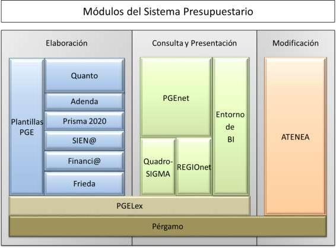

## Ámbito del presupuesto

#### El sistema presupuestario

El sistema presupuestario se compone de un conjunto de módulos, orientado cada uno de ellos al cumplimiento de una finalidad específica, que se agrupan en diversas categorías:

<table>
<tr>
<th>Elaboración del articulado del Proyecto de Ley de PGE</th>
<th>PGELex</th>
</tr>
<tr>
<td>Elaboración y consulta de estados financieros de los PGE:</td>
<td>&nbsp;</td>
</tr>
<tr>
<td>-Pre-elaboración</td>
<td>Plantillas PGE</td>
</tr>
<tr>
<td>-Elaboración</td>
<td>Quanto, Adenda, Financi@, Prisma 2020 y SIEN@</td>
</tr>
<tr>
<td>-Consulta</td>
<td>Quadro-SIGMA y REGIOnet</td>
</tr>
<tr>
<td>Presentación y publicación</td>
<td>PGEnet y entorno de BI</td>
</tr>
<tr>
<td>Otra información que acompaña a los PGE</td>
<td>FRIEDA</td>
</tr>
<tr>
<td>Modificaciones presupuestarias</td>
<td>ATENEA</td>
</tr>
<tr>
<td>Auxiliar de formateo e impresión</td>
<td>Pérgamo</td>
</tr>
</table>

Tecnológicamente, el sistema presupuestario se asienta en desarrollos centralizados en el Centro de Producción de la Oficina de Informática Presupuestaria, y a través de tecnologías web se pone a disposición de usuarios internos (fundamentalmente la Dirección General de Presupuestos y la Secretaría de Estado de Presupuestos y Gastos), y usuarios ajenos a la red de la Administración Presupuestaria (principalmente las Oficinas Presupuestarias de los departamentos ministeriales, pero también otros centros gestores de los Ministerios y entidades del sector público empresarial y fundacional). De esta forma, los puestos de trabajo pueden interactuar con el sistema con el único requisito de disponer de un navegador estándar de Internet y un visor de archivos PDF.

Con los permisos de acceso y ejecución pertinentes, está previsto que a los distintos módulos puedan acceder los distintos agentes que intervienen en el proceso presupuestario:

- Los centros gestores de naturaleza administrativa con presupuesto estimativo, así como las entidades de carácter empresarial y fundacional (CG).

- Las Oficinas presupuestarias existentes en cada Ministerio (OP).

- La Central presupuestaria (Dirección General de Presupuestos -DGP-), del Ministerio de Hacienda. El sistema presupuestario está disponible para su acceso por distintos medios:

- Intranet de la Administración Presupuestaria, es decir, la red privada interna que se extiende a los centros de la Secretaría de Estado de Presupuestos y Gastos, y en la que se incluye la Dirección General de Presupuestos.

- Intranet administrativa (Red Sara).

- Internet, esto es, a través de la red pública indicada. En este caso, los potenciales usuarios deben disponer de un certificado electrónico para acreditarse por primera vez ante el sistema.

Actuaciones previstas en el ámbito presupuestario

El sistema presupuestario se puede considerar altamente consolidado en su funcionamiento, sin perjuicio de que resulte necesario atender y emprender actuaciones de mejora, reordenación y ampliación puntual de funcionalidades.

Los siguientes apartados describen las actuaciones previstas en el sistema presupuestario, incluyendo otros módulos que sin formar parte del proceso de elaboración y publicación de los PGE están orientados a dar el soporte informático a las actuaciones de la Dirección General de Presupuestos por motivo de su ámbito competencial, como ATENEA, el sistema de tramitación y seguimiento de los expedientes de modificaciones presupuestarias del sector público estatal, y Ariadn@, para la tramitación interna de los expedientes que llegan para informe.

Elaboración presupuestaria

### Iniciativas legislativas, articulado de la Ley y sus enmiendas: PGELex

Para el bienio 2025-2026 se han previsto, adicionalmente a la atención a necesidades habituales de un sistema en producción, las siguientes actuaciones principales en PGELex:

- Incorporación de una nueva utilidad para el usuario que le permita acceder a una vista previa PDF del informe, de cara a anticipar posibles problemas de conversión de formato en la generación posterior de los libros.

- Análisis e incorporación de indicadores en el Cuadro de mando OIP.

- Revisión y ampliación del alcance actual de la auditoría de la actividad de usuario.

### Núcleo de la elaboración presupuestaria: Quanto, Adenda y Financi@

Las actuaciones previstas para el periodo 2025-2026 son las siguientes (QUANTO):

- En la Central de estructuras, nuevas utilidades de administración para facilitar el borrado de estructuras presupuestarias, en particular en el contexto de reorganizaciones ministeriales.

- Análisis e implementación de una nueva vinculación entre créditos y dotaciones, y previsiones presupuestarias.

- En Previsiones, diseño de nuevos informes de control para comparar importes frente a créditos y dotaciones, por secciones y capítulos.

- Nueva opción para permitir consultas agregadas con más de un valor para un mismo criterio (programas, subsectores, capítulos, etc.)

- Revisión y mejora de la funcionalidad de carga mediante ficheros XML.

- Revisión y ampliación del alcance actual de la auditoría de la actividad de usuario.

- Análisis e incorporación de indicadores en el Cuadro de mando OIP. Para el periodo 2025-2026, las actuaciones previstas son (ADENDA):

- Mejoras en la funcionalidad de actualización de sueldos de Personal para cubrir el caso de la modificación de importes en el ejercicio en curso.

- Incorporación de la posibilidad de escoger el ejercicio de base en la creación de un nuevo Presupuesto.

- Revisión y ampliación del alcance actual de la auditoría de la actividad de usuario.

- Análisis e incorporación de indicadores en el Cuadro de mando OIP.

Las actuaciones previstas para el periodo 2025-2026 son las siguientes (FINANCI@):

- Nueva opción de administración para visualizar la relación entre los informes existentes en Financi@ con PGEnet, al objeto de facilitar la gestión de informes oficiales.

- Nuevas validaciones en la apertura y en el cierre presupuestario relativas a la actualización de los códigos DIR3 de entidades, a efectos del Portal de Transparencia.

- Mejoras en la creación del nuevo ejercicio (trazabilidad, eliminación del ejercicio, realización por parte de los administradores DGP).

- Análisis e incorporación de indicadores en el Cuadro de mando OIP.

- Elaboración de los presupuestos de INGESA e IMSERSO (Prisma 2020), y elaboración y modificación de los fondos de compensación y complementario (SIEN@)

En la actualidad existen dos aplicaciones específicas de elaboración presupuestaria adicionales a las integrantes del sistema presupuestario indicadas anteriormente:

- Prisma 2020, para la elaboración presupuestaria de INGESA (Instituto Nacional de Gestión Sanitaria) y en IMSERSO (Instituto de Mayores y Servicios Sociales).

- SIEN@, para la elaboración y, en su caso, posterior modificación de los fondos de compensación y complementario previstos en el vigente sistema de financiación autonómica.

Prisma 2020 fue implantada en 2023 en sustitución de PRISMA 2000 y OASIS, y en 2024 ha sido empleada por primera vez para la elaboración del Proyecto de Ley de Presupuestos Generales del Estado para 2025. En 2025 se analizarán e incorporarán indicadores en el Cuadro de mando OIP.

En el caso de SIEN@, las actuaciones previstas para el periodo 2025-2026 son:

- Incorporación de la posibilidad de escoger el ejercicio de base en la creación de un nuevo Presupuesto.

- Análisis e incorporación de indicadores en el Cuadro de mando OIP.

- Revisión y ampliación del alcance actual de la auditoría de la actividad de usuario.

Consulta y presentación

### Consultas a los datos de Quanto: Quadro-SIGMA y REGIOnet

Las actuaciones previstas en Quadro-SIGMA para el bienio 2025-2026 son:

- Nueva versión tecnológica de Quadro-SIGMA (incluye una revisión de la gestión de permisos sobre informes, y la posibilidad de incluir literales en las consultas en formato tabla)

- Análisis e incorporación de indicadores en el Cuadro de mando OIP.

En el caso de REGIOnet, en 2025 se prevé mejorar la documentación de las funcionalidades de administración para la DGP.

### Publicación oficial de los Presupuestos Generales del Estado: PGEnet

Para el bienio 2025-2026 se prevén las siguientes actuaciones:

- Nuevo informe de estructura de política de gastos y programas.

- Mejoras varias identificadas en los últimos procesos de publicación del proyecto de Ley:

- Nueva funcionalidad para permitir a determinados usuarios de la DGP realizar controladamente el rechazo de imprenta.

- Incorporación en los correos de aviso de información acerca de las actuaciones pendientes de realizar.

- Identificación de los cambios concretos que acompañan a cada versión de la publicación e incorporación en el documento relativo al “Tratamiento de la información y verificación de la integridad de la documentación publicada y la distribuida en otros soportes digitales”.

- Eliminación de la funcionalidad de envío a imprimir, que permite a los usuarios de sala acceder a la cola de trabajos de impresión.

- Mejora de la documentación de las funcionalidades de administración tanto para la DGP como para los administradores centralizados.

### Explotación y difusión de la información presupuestaria

Durante el bienio 2025-2026 se espera continuar avanzando en la implementación de nuevas capacidades en el entorno de Business Intelligence (BI), que incluye procesos de extracción, transformación y carga de datos de manera automática y diaria desde las principales aplicaciones del Sistema Presupuestario, su integración en un data warehouse corporativo, la explotación de una parte de dicha información a través de modelos de análisis, y la presentación de dicha información a través de informes interactivos ofrecidos interna y/o externamente, según su

propósito. En 2025, una primera actuación en este ámbito será la puesta en Producción del entorno de BI, y la implantación de un proceso sistemático y automatizado de control de acceso y acceso a los informes. Por otro lado, discriminando por los distintos negocios a los que da cobertura dicho entorno, cabe distinguir las siguientes actuaciones:

- Ajustes y nuevos informes que en su caso plantee DGP en el ámbito de Presupuestos Transversales.

- Mantenimiento y evolución de informes relativos a modificaciones presupuestarias (nuevo informe de estructuras presupuestarias, nuevo informe de aplicaciones presupuestarias afectadas por modificaciones, etc.)

- Mantenimiento y evolución de informes para la presentación del Proyecto de Ley y de la Ley de Presupuestos.

- Elaboración de un cuadro de mando con estadísticas de uso y situación de elaboración en las distintas aplicaciones.

Modificaciones presupuestarias: ATENEA

La aplicación ATENEA da soporte a los procedimientos de tramitación y seguimiento de los expedientes de modificaciones presupuestarias del sector público estatal.

Para el bienio 2025-2026 están previstas, como principales, las siguientes actuaciones:

- Adaptaciones en la gestión del Fondo de Contingencia y de Expedientes para contemplar la casuística en que dicho fondo consta de varias aplicaciones presupuestarias, con motivo de la DANA.

- Revisión de la transaccionalidad del flujo de firmas en Fase OP, al objeto de evitar la repetición de firmas.

- Nueva opción para permitir sustituir un documento por otra versión firmada del mismo.

- Sellado con certificado de sello DGP de las comunicaciones de la toma de razón descritas en la Resolución de 8 de noviembre de 2017 de la DGP.

- Ampliación de los cargos a los que se puede delegar la firma.

- Ampliación de información consultada a SIC’3 (crédito disponible, ejecución en organismos, años anteriores y futuros, y nuevo informe que combine los datos del presupuesto inicial del capítulo 1 con los datos de ejecución)

- Mejoras en la tramitación de expedientes de compromisos futuros (captura de aplicaciones por pantalla, nuevos campos para registrar textos y tablas, incorporación de firma en fase OP a este tipo de expedientes)

- Extensión de la firma en fase OP a organismos del Ministerio de Hacienda.

- Extensión de la firma en fase OP a otros Ministerios y organismos.

- Análisis funcional y tecnológico de nuevas soluciones para sustituir a ATENEA.

- Análisis e incorporación de indicadores en el Cuadro de mando OIP.

Otras actuaciones del ámbito presupuestario

### Ariadn@

Sin formar parte del sistema presupuestario, la aplicación Ariadn@ soporta desde 2017 la tramitación interna en la DGP de expedientes que llegan a dicho centro directivo para ser informados, y desde 2024 la tramitación interna en Gabinete de la Secretaría de Estado de Presupuestos y Gastos de expedientes que llegan a dicha unidad.

Para el periodo 2025-2026 se prevén las siguientes actuaciones:

- Mejoras en la asignación de asuntos entre comisiones, incluyendo la transferencia de asuntos entre comisiones.

- Nueva consola para la consulta de información de auditoría, tanto para el administrador centralizado como para los administradores de cada unidad.

- Refactorización y homogeneización de la funcionalidad ofrecida a Gabinete y a la DGP.

- Mejoras en el filtrado de expedientes.

- Automatización de tareas para mayor control de los estados por los que transita un expediente y sus comunicaciones.

- Análisis e incorporación de indicadores en el Cuadro de mando OIP.

### FRIEDA

FRIEDA es un sistema orientado a la elaboración de determinados informes presupuestarios de carácter transversal que según establece el artículo 37 de la Ley General Presupuestaria, deben acompañar al proyecto de Ley de Presupuestos Generales del Estado para su remisión las Cortes Generales. En la actualidad, FRIEDA cubre la elaboración de los siguientes informes: 1) el informe de alineamiento de los Presupuestos Generales del Estado con los Objetivos de Desarrollo Sostenible de la Agenda 2030; 2) el informe de impacto de género; 3) el informe de alineamiento de los Presupuestos Generales del Estado con la Transición Ecológica (dimensiones verde y marrón);

4) el informe de juventud; y 5) el informe de infancia, adolescencia y familia. Durante el bienio 2025-2026 se plantean las siguientes actuaciones:

- Estudio de viabilidad de la unificación del registro de datos de distintos ámbitos por estructuras presupuestarias.

- Nuevas opciones para los administradores DGP (mantenimiento de parámetros de usuario para dominios, campos de intervención, dimensiones de colectivos IAF, etc.)

- Mejora de la documentación de las funcionalidades de administración tanto para la DGP como para los administradores centralizados.

- Análisis e incorporación de indicadores en el Cuadro de mando OIP.

Otras actuaciones

Durante el bienio 2025-2026 se llevará a cabo el análisis e implementación de dos nuevas aplicaciones:

- Nueva aplicación para facilitar la gestión y explotación de información correspondiente a la nueva versión revisada de la memoria de objetivos e indicadores. Se enmarca en el Sistema Presupuestario, y su alcance está aún por concretar, en la medida en que depende de las conclusiones del Grupo de Trabajo de la DGP para la revisión de la información presupuestaria.

- Nueva aplicación para la gestión y explotación de la información correspondiente a los procesos de revisión del gasto público (Spending Reviews). Surge como consecuencia de una nueva función asumida por una unidad de reciente creación en el seno de la DGP, y no forma parte del Sistema Presupuestario.
