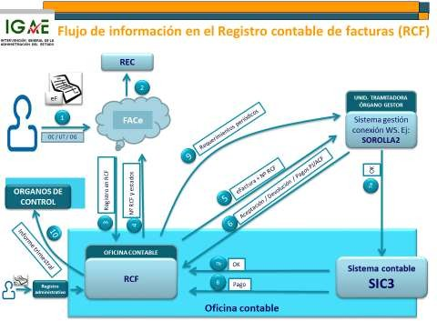

## Ámbito de contabilidad y control.

Análisis de la situación actual.

La solución informática actual para tratar la gestión, el control económico-financiero y la contabilidad pública viene dada a través de una red interrelacionada de sistemas de información, en la que, considerando que cada elemento o sistema puede corresponder a un periodo de generación diferente e incluso a tecnologías y arquitecturas distintas, se establecieron las interfaces adecuadas para garantizar su interoperabilidad.

La caracterización de esta red de sistemas, y de cada elemento que la constituyen, pasa por la determinación de los dominios de información y de sus destinatarios.

Los destinatarios de los sistemas de información al servicio de la gestión económico-presupuestaria, la contabilidad y el control son la Intervención General de la Administración del Estado (IGAE) y sus intervenciones delegadas, regionales y territoriales; el resto de centros directivos de la Secretaría de Estado de Presupuestos y Gastos; la Secretaría General del Tesoro y Financiación Internacional y la D.G. del Patrimonio del Estado; las oficinas contables de organismos, agencias estatales, universidades públicas y comunidades autónomas adheridas al sistema contable.

Universidades públicasUniversidades públicasComisión UEComisión UEÁmbito de servicio de la Oficina de Informática Presupuestaria

Sector Público EstatalAGESPASPESEPGIGAE SGTFIII.DD. DGPEDEH OO.PP.II.DD.O.C.UEFUEFSector Público EstatalAGESPASPESEPGIGAE SGTFIII.DD. DGPEDEH OO.PP.II.DD.O.C.UEFUEFCC.AA.EE.LL.Sector Público TerritorialCC.AA.EE.LL.Sector Público Territorial

AGE: Administración General del EstadoCC.AA.: Comunidades autónomasDEH: Delegaciones de Economía y HaciendaDGPE: Dirección General del Patrimonio del Estado EE.LL.: Entidades LocalesIGAE: Intervención General de la Administración del Estado II.DD.: Intervenciones delegadasOC: Oficinas contablesAGE: Administración General del EstadoCC.AA.: Comunidades autónomasDEH: Delegaciones de Economía y HaciendaDGPE: Dirección General del Patrimonio del Estado EE.LL.: Entidades LocalesIGAE: Intervención General de la Administración del Estado II.DD.: Intervenciones delegadasOC: Oficinas contablesOO.PP.: Oficinas presupuestariasSEPG: Secretaría de Estado de Presupuestos y GastosSGTFI: Secretaría General del Tesoro y Financiación Internacional SPA: Sector público administrativoSPE: Sector público empresarialUE: Unión EuropeaUEF: Unidad económico financieraOO.PP.: Oficinas presupuestariasSEPG: Secretaría de Estado de Presupuestos y GastosSGTFI: Secretaría General del Tesoro y Financiación Internacional SPA: Sector público administrativoSPE: Sector público empresarialUE: Unión EuropeaUEF: Unidad económico financiera

Los sistemas de información de esta red se proyectan sobre un amplio ámbito de servicio que abarca, desde una concepción integradora, las funciones de gestión económico-presupuestaria de los órganos gestores; fiscalizadora, a cargo de la IGAE y sus intervenciones delegadas, regionales y territoriales; de gestión contable y de información económico-presupuestaria, por la Oficina Nacional de Contabilidad y las oficinas contables; de elaboración de las cuentas económicas del sector público, por la Oficina Nacional de Contabilidad; de control de la gestión económico- financiera y de subvenciones, a través de la Oficina Nacional de Auditoria y de las intervenciones delegadas, regionales y territoriales; y de control de la gestión patrimonial.

A continuación, se describe la situación actual de cada uno de estos dominios funcionales diferenciados y, posteriormente, se formulan los objetivos y prioridades, para cada uno de ellos, en el ámbito temporal de este Plan Director.

### Sistemas orientados a la función interventora.

Las intervenciones delegadas, regionales y territoriales disponen de un modelo informático que integra las funciones de registro, archivo y seguimiento de expedientes de gasto, cualquiera que sea el soporte electrónico o papel de los documentos, y de apoyo a su fiscalización, mediante la interoperabilidad de los sistemas que dan cobertura a dichas funciones, entre ellos mismos y con los sistemas de información contable y para la gestión.

Tramitación electrónica de expedientes y documentos contables

SOROLLA2Portafirmas Electrónico IGAEGESTIÓNCentro gestorPortafirmas electrónico propioSistema propio de gestiónSOROLLA2Portafirmas Electrónico IGAEGESTIÓNCentro gestorPortafirmas electrónico propioSistema propio de gestiónExpediente papelExpedienteelectrónicoIGAESeguimientoy fiscalizaciónIRISTELCONContabilidadSIC’3FISCALIZACIÓN Y CONTABILIDADRegistro y ArchivoRAYOnetOficina de intervenciónExpediente papelExpedienteelectrónicoIGAESeguimientoy fiscalizaciónIRISTELCONContabilidadSIC’3FISCALIZACIÓN Y CONTABILIDADRegistro y ArchivoRAYOnetOficina de intervención

##### RAYOnet: Sistema para el registro normalizado, archivo departamental y gestión documental en las intervenciones delegadas, regionales y territoriales.

El registro y archivo departamental de aquella documentación presentada en soporte papel de los expedientes de gasto se realiza a través del sistema RAYOnet.

Es un sistema integrado bajo arquitectura web, centralizado en los sistemas centrales de la Oficina de Informática presupuestaria, que integra las prestaciones de registro y archivo departamental de las Intervenciones delegadas, regionales y territoriales. También utilizan este mismo sistema, como servicio de carácter horizontal, el Gabinete de la Secretaría de Estado de Presupuestos y Gastos, la D.G. Costes de Personal y los servicios centrales de la IGAE, para su sistema corporativo de registro.

Desde el punto de vista organizativo, el sistema permite la convivencia de múltiples entidades registrales y admite por cada entidad una o varias unidades registrales, que pueden estar o no asociadas al registro oficial, cada una con un archivo departamental. Cada usuario puede acceder a una o varias entidades registrales.

Como sistema de registro de entrada/salida facilita el asiento registral de los documentos y expedientes que entren y salgan en/de la unidad. Por cada asiento registral permite su certificación, su asociación con otros asientos registrales de entrada o salida y un seguimiento básico de la tramitación interna. Puede configurarse para generar asientos registrales por las entradas y salidas a través de las cuentas de correo (personales o genéricas) del sistema corporativo de mensajería electrónica de usuarios de la unidad registral.

El sistema proporciona servicios web para la generación de apuntes registrales desde otras aplicaciones de gestión (IRIS, AUDInet, sistemas de clases pasivas, etc.), habiendo ampliado el alcance de la comunicación entre aplicaciones y RAYOnet para contemplar distintos escenarios de interoperabilidad. Permite asimismo la digitalización certificada de documentos, mediante sello electrónico para actuación administrativa automatizada, y su almacenamiento en la plataforma corporativa de documentos y firma electrónica (SGIFE).

Una vez obtenida la certificación del sistema de registro bajo la arquitectura SIR (Sistema de Interconexión de Registros) basada en el formato SICRES de asientos registrales, se pueden configurar las oficinas de registro de RAYOnet como oficinas SIR, por tanto, interconectadas con otros registros oficiales SIR, como ya lo están haciendo el registro oficial de la IGAE, el de la D.G. Costes de Personal y el de las Delegaciones de Economía y Hacienda, o como registro autónomo. Asimismo, se obtuvo la certificación de RAYOnet como sistema de registro adaptado a los requerimientos de la hoja de ruta SIR, en cuanto a la anotación automática en el libro único de registro de la AGE (REGAGE) y respecto a la estructura del fichero técnico de metadatos.

Actualmente se está abordando un proyecto de estudio de la migración al entorno de GEISER2 cuando se encuentre disponible dicho sistema como servicio común de la AGE.

Como sistema de archivo y gestión documental permite el almacenamiento y posterior recuperación de imágenes digitalizadas y documentos ofimáticos, en una estructura jerárquica de contenedores, agrupados bajo un expediente, y clasificados en carpetas.

La actual versión del sistema de archivo y gestión documental permite tres modalidades de archivo: para los justificantes de los documentos contables (en el caso de las oficinas contables de la AGE), con destino al Tribunal de Cuentas; para el archivo de la documentación asociada a los asientos registrales. En el primer caso, la estructura de contenedores del archivo viene establecida, quedando el expediente identificado por el número de operación contable; en el segundo, la estructura, quedando el expediente identificado por el número de asiento registral; y en el tercero, el administrador de archivo de la unidad es de libre configuración.

Para facilitar la rendición al Tribunal de Cuentas de los justificantes digitalizados se utiliza un procedimiento para la obtención centralizada del archivo en la IGAE y una versión específica de la aplicación para el Tribunal de Cuentas.

Una adaptación específica de RAYOnet, denominada RAYO-Seguimiento, se ha utilizado por el Gabinete de la Secretaría de Estado de Presupuestos y Gastos para el registro y seguimiento de los expedientes de Consejo de Ministros, de la Comisión delegada de Asuntos Económicos, y de la Comisión de Secretarios de Estado y Subsecretarios.

##### Aplicación (o servicios web) IRIS-envíos para la tramitación telemática de expedientes de gasto.

El registro y archivo de la documentación electrónica de los expedientes de gasto, cuando se produce la tramitación telemática de los mismos en las relaciones entre los órganos gestores y la intervención, se realiza centralizadamente en la IGAE a través del sistema IRIS-envíos.

Se trata de una aplicación corporativa de la IGAE bajo arquitectura web para facilitar a las unidades de tramitación de los órganos gestores (bien mediante la propia aplicación o a través de los correspondientes servicios web consumidos desde sus propios sistemas de gestión) la remisión telemática de la documentación electrónica de los expedientes a efectos de su fiscalización, mediante la enumeración de la documentación constitutiva de los mismos, con indicación del soporte papel o electrónico de cada documento, y la aportación de la documentación electrónica, así como la tramitación telemática de dichos expedientes.

Dispone de un repositorio centralizado de expedientes tramitados por esta vía, con sus documentos y firmas electrónicas, integrado con el sistema IRIS-intervención para la gestión de la fiscalización en la correspondiente intervención delegada u órgano de control.

Tramitación electrónica de expedientes y documentos contables

Centro gestor

IGAEIntervenciones delegadas

Firma de ladnInterventorocumentacióFiscalización electrónicaPortafirmas Electrónico IGAEServicioFiscalPreparación fiscalizaciónIRISSistema de gestión SOROLLA2RAYOnetEnvío/recepción de expedientesRepositorio expedientes y firmasRepositorio justificantes en papelFirma de ladnInterventorocumentacióFiscalización electrónicaPortafirmas Electrónico IGAEServicioFiscalPreparación fiscalizaciónIRISSistema de gestión SOROLLA2RAYOnetEnvío/recepción de expedientesRepositorio expedientes y firmasRepositorio justificantes en papel

##### IRIS-intervención: Sistema para el seguimiento de los expedientes de gasto y de apoyo a la gestión de la fiscalización previa en la IGAE y las intervenciones delegadas, regionales y territoriales.

La gestión de la fiscalización y el seguimiento de los expedientes de gasto se apoya en el sistema IRIS- intervención.

Este sistema gestiona la información de los expedientes de gasto objeto de fiscalización, relacionándolos con la documentación electrónica tramitada a través de IRIS-envíos o/y con la documentación en soporte papel digitalizada a través de RAYOnet-Archivo.

Facilita la clasificación del expediente en función de las categorías contempladas en el Acuerdo de Consejo de Ministros sobre el ejercicio de la función interventora en régimen de requisitos básicos, y lo asocia a la documentación electrónica o/y al asiento registral de entrada que corresponda. Permite la aportación de los datos generales del expediente, de la relación de la documentación constitutiva del mismo, y de información específica asociada al tipo de expediente en cuestión (contratos, subvenciones, nóminas, cuentas justificativas de anticipos de caja fija o de pagos a justificar, etc.).

El sistema ayuda a verificar el cumplimiento de los requisitos esenciales de fiscalización, solicita la información relevante acerca del acto de fiscalización y, opcionalmente, facilita la emisión del correspondiente informe fiscal.

Asimismo, en el caso de los expedientes constituidos total o parcialmente por documentos electrónicos, permite la visualización de los documentos y sus firmas desde el repositorio centralizado, y, cuando se cumplan las condiciones para ello, el ejercicio de la fiscalización electrónica de los expedientes, poniendo el resultado de la fiscalización a disposición del órgano gestor a través de IRIS-envíos (o de los correspondientes servicios web asociados). La firma electrónica del informe de fiscalización se puede realizar directamente en IRIS o utilizando los servicios del portafirmas electrónico corporativo (DocelWeb) que se describe en el apartado de servicios horizontales.

El sistema IRIS facilita también la gestión de las instrucciones sobre las medidas de refuerzo del control para el cumplimiento del plan de revisión del gasto y el plan de austeridad. Asimismo, posibilita el tratamiento

específico de información sobre las mesas de contratación y para el control de los procedimientos de licitación y adjudicación de contratos, subvenciones y encomiendas de gestión.

Por otra parte, gestiona la generación de los índices de remisión a los centros gestores del resultado de la fiscalización y el envío de la documentación contable de los expedientes, una vez aprobados, a la oficina contable, para su tratamiento en SIC’3. Tanto IRIS-envíos como IRIS-intervención están preparados para recibir del gestor y enviar a la oficina contable documentos contables en formato fichero, cuando su obtención se ajuste a las especificaciones del formato TELCON, publicadas en el portal de la Administración presupuestaria. En este caso, también se tramita a su través el acuse de recibo de la contabilización o rechazo de dichos documentos en el sistema contable.

Finalmente, incorpora la tramitación electrónica de expedientes de gasto de Defensa cuya competencia de control corresponde a la IGAE. También se han sentado las bases para aplicar controles automatizados a partir de documentos estructurados, como objetivo clave de ESADI, que se inició con dos proyectos piloto que implementaron esos controles automáticos: la tramitación de pagos de fondos europeos y la tramitación por pagos masivos de las devoluciones de tasas y sanciones en la Dirección General de Tráfico. Actualmente se sigue activamente con los trabajos necesarios para la incorporación del resto de verificaciones automatizadas recogidas en las conclusiones de ESADI.

##### COREnet: sistema para el control de los actos de comprobación material de la inversión.

Para el control de los actos de comprobación material de la inversión se está utilizando por los centros gestores, la S. G. Intervención y Fiscalización de la IGAE, y las Intervenciones delegadas, regionales y territoriales una solución informática específica denominada COREnet.

Se trata de un sistema diseñado para el registro, control y seguimiento de las solicitudes de recepción procedentes de los centros gestores. El sistema permite el registro y análisis de admisión de las solicitudes de recepción procedentes de los centros gestores y de los propios interventores; el análisis, selección, designación y emisión de la resolución que proceda, la emisión de las comunicaciones al centro gestor, interventor designado y asesor, en su caso, y el archivo de la correspondiente acta de recepción, por la intervención designada. Se incorporó además un nuevo modelo de asignación de asesores, más eficiente y distribuido, basado en su asignación a través de delegados para la asignación de asesores (ODA), previamente establecidos por ministerios y materias.

El sistema facilita a los interventores actuantes consultar las solicitudes asignadas y el seguimiento de las designaciones tanto por el interventor designado como por aquel al que corresponde la fiscalización de la obligación y la aportación del acta de recepción. Al respecto del acta, se emitió un procedimiento técnico para su firma electrónica por los participantes en el acto de comprobación material de la inversión.

La solución inicial fue complementada con un servicio electrónico a través de Internet, dirigido a los centros gestores, que les permite formular dicha solicitud de comprobación material de la inversión, consultar su situación y acceder a la comunicación telemática de la designación de representante de la IGAE para el acto de recepción. Se reguló posteriormente la obligatoriedad de la vía telemática para la participación de los centros gestores en este procedimiento y se amplió la información recabada en la solicitud.

### Sistema de información contable.

Las referencias principales en este ámbito de información son las siguientes:

##### Sistema de información contable del Estado y organismos públicos (SIC’3).

El núcleo básico del sistema contable incluye la contabilidad presupuestaria de gastos e ingresos, y de operaciones no presupuestarias; la contabilidad económico patrimonial; la gestión y posición de los terceros y sus incidencias; el registro contable de facturas, y más recientemente el registro de cesiones de crédito derivados de facturas o contratos; el seguimiento de los proyectos de gasto; el control de pagos a justificar y anticipos de caja fija; la ordenación y gestión de pagos; el control de cobros y la tesorería; y el seguimiento de

gastos con financiación afectada. Adicionalmente integra un conjunto de subsistemas complementarios (gestión recaudatoria de ingresos no tributarios y contraído previo de dichos ingresos; gestión y contabilidad de la Caja General de Depósitos y sus sucursales; así como el nuevo subsistema de Avales del Estado) y se conecta con módulos especializados de gestión (endeudamiento; inmovilizado, financiero y no financiero; y préstamos).

financierono financierofinancierono financieroEstructura general del sistema de información contable (SIC)

<table>
<tr>
<th>SIC’3SeguimientoOrdenación yControl de gastos proyectostesoreríafinanciación afectada

     ContabilidadContabilidad presupuestariaeconómico Cajeros pagadorespatrimonialIngresos no ACF y PJtributarios  OPERACIONES

   Registro contable deTercerosContraído previo facturas    Remanentes deCaja de depósitos crédito</th>
</tr>
<tr>
<td> Préstamo</td>
<td> s y avalesInmovi</td>
<td> lizadoInmovi</td>
<td> lizadoEndeud</td>
<td> amiento</td>
</tr>
</table>

El sistema de información contable se encuentra operativo en las siguientes oficinas contables.

<table>
<tr>
<th>OFICINAS CONTABLES</th>
<th>2024</th>
<th>TOTAL</th>
</tr>
<tr>
<td>Administración General del Estado</td>
<td>&nbsp;</td>
<td>80</td>
</tr>
<tr>
<td>Intervenciones delegadas en Ministerios</td>
<td>22</td>
<td>&nbsp;</td>
</tr>
<tr>
<td>Intervenciones territoriales en delegaciones de Economía y Hacienda</td>
<td>56</td>
<td>&nbsp;</td>
</tr>
<tr>
<td>S.G. del Tesoro y Política Financiera</td>
<td>1</td>
<td>&nbsp;</td>
</tr>
<tr>
<td>Oficina de Central Contable</td>
<td>1</td>
<td>&nbsp;</td>
</tr>
<tr>
<td>Organismos y entidades públicas</td>
<td>&nbsp;</td>
<td>86</td>
</tr>
<tr>
<td>Organismos autónomos</td>
<td>57</td>
<td>&nbsp;</td>
</tr>
<tr>
<td>Entes Públicos estatales y Agencias Estatales</td>
<td>18</td>
<td>&nbsp;</td>
</tr>
<tr>
<td>Universidades públicas</td>
<td>3</td>
<td>&nbsp;</td>
</tr>
<tr>
<td>Comunidades Autónomas</td>
<td>1</td>
<td>&nbsp;</td>
</tr>
<tr>
<td>Organismos autónomos de CC.AA.</td>
<td>4</td>
<td>&nbsp;</td>
</tr>
<tr>
<td>Fundaciones</td>
<td>1</td>
<td>&nbsp;</td>
</tr>
<tr>
<td>Órganos Constitucionales</td>
<td>2</td>
<td>&nbsp;</td>
</tr>
<tr>
<td>TOTAL</td>
<td>&nbsp;</td>
<td>166</td>
</tr>
</table>

(Datos a 31/12/2024)

En la Administración General del Estado actúan como oficinas contables del sistema:

- Las oficinas contables de Ministerios, en las intervenciones delegadas, y la Subdirección General de Contabilidad del Ministerio de Defensa, para contabilizar las operaciones de los centros gestores del gasto y de ingresos.

- Las oficinas contables de delegaciones de Economía y Hacienda, en las intervenciones territoriales, para contabilizar las operaciones derivadas de los centros gestores territoriales de gasto e ingreso y de las sucursales de la Caja de depósitos.

- La oficina contable de Tesoro, para el registro contable de las operaciones derivadas de su actuación como gestor de la deuda pública, como ordenador de pagos y como caja pagadora central, así como las de ingresos y de la Central de la Caja de depósitos.

- La Central contable.

En este ámbito de la AGE la centralización informática de la capacidad de proceso y de almacenamiento del SIC3 se migró a un clúster de servidores Linux como parte de una renovación tecnológica de la infraestructura de la OIP. En el caso de los organismos, el sistema se configura con una única oficina contable para cada uno de ellos, habiendo sido con el sistema SIC`3, cuando comenzó a proporcionarse servicio de hospedaje centralizado en la IGAE, sin perjuicio de que la gestión y administración del sistema corresponda a la oficina contable de cada organismo.

Dentro del sistema de información contable merecen un apartado especial las interfaces del sistema contable Es con los gestores de gastos (TELCON y cuentas justificativas electrónicas) y con los gestores de ingresos (INTECO). Asimismo cabe señalar la interfaz con el Punto general de entrada de facturas electrónicas de la Administración General del Estado (FACe) para la recepción de las facturas electrónicas; la integración del Registro de cesiones de crédito; la interfaz con el Punto neutro de embargos para la tramitación electrónica de las actuaciones de embargo; con el órgano de control para la fiscalización electrónica de las propuestas de modificación de descuentos y de las propuestas de PMP derivadas de la gestión de incidencias de terceros por Tesoro; y con el Banco de España o las entidades financieras, a efectos de los pagos por transferencia. Tienen especial relevancia los interfaces existentes para el intercambio de información con la AEAT a través de EDITRAN. desde los módulos de Ingresos e INTECO (justificantes de ingresos efectuados en sucursales bancarias, devoluciones de ingresos indebidos, devoluciones de coste de garantías, etc.).

##### Tramitación electrónica de los documentos contables (TELCON) y de cuentas justificativas electrónicas.

La publicación, en la oficina virtual del portal de la Administración presupuestaria en Internet, de las especificaciones TELCON para el intercambio de documentos contables entre sistemas de información supuso un avance muy importante en el ámbito de la administración electrónica.

Esta iniciativa, que exigió la adaptación a la interfaz TELCON de las aplicaciones de la IGAE orientadas a la gestión, fiscalización y contabilidad, ha permitido desde entonces la tramitación de los documentos contables en soporte fichero entre el órgano gestor y la oficina contable.

Se regularon normativamente los procedimientos para la tramitación de documentos contables en soporte fichero, considerando dos alternativas: documentos contables electrónicos y lotes de documentos contables en soporte fichero, y se desarrollaron los servicios web necesarios para facilitar la tramitación telemática, a través de IRIS, de aquellos documentos contables expedidos bajo las especificaciones TELCON.

Posteriormente se efectuaron las adaptaciones necesarias en IRIS y SIC’3 para facilitar el tratamiento de las modificaciones de crédito y las retenciones de crédito de no disponibilidad, expedidas desde el sistema ATENEA como documentos electrónicos, y para la tramitación de lotes de documentos contables TELCON mediante servicios web. También se amplió el alcance de las especificaciones TELCON a documentos de ingresos, a petición de determinados organismos.

Más recientemente se estableció la obligatoriedad de los documentos contables electrónicos, aunque con ciertas excepciones previstas, lo que ha exigido la adecuación de los sistemas del ciclo de ejecución

presupuestaria. La transición a este formato electrónico obligatorio se ha gestionado sin incidentes, estando en la actualidad plenamente implementado con muy pocas excepciones.

Por su parte, también se reguló la tramitación electrónica de las cuentas justificativas a través de modelos normalizados de cuentas justificativas de los pagos a justificar y para la reposición de anticipos de caja fija en soporte fichero. De acuerdo con dicha regulación, las especificaciones técnicas de estructura de la cuenta justificativa y las condiciones de empaquetamiento con los justificantes electrónicos de las mismas están publicadas en el portal de Internet de la IGAE.

##### Aplicación para la expedición de justificantes de ingresos no tributarios (INTECO).

Esta aplicación de SIC’3 facilita la expedición de los justificantes de ingresos no tributarios aptos para efectuar

el ingreso en entidades colaboradoras.

Se han establecido tres alternativas para la utilización de INTECO por los órganos gestores de estos ingresos: mediante captura interactiva; por remisión de fichero normalizado obtenido desde su aplicación de gestión; o utilizando los servicios web proporcionados por la IGAE.

Se publicaron en la subsede electrónica de la IGAE servicios electrónicos para permitir la emisión de determinados modelos de ingresos por el interesado a través de Internet, así como la consulta y, en su caso, pago telemático de las deudas no tributarias a través de la pasarela de pago de la AEAT. También se incorporaron servicios electrónicos para la solicitud de fraccionamientos y aplazamientos de deudas no tributarias. Se ha introducido la adaptación necesaria en SIC’3 para la domiciliación de aplazamientos y fraccionamientos de deudas no tributarias, concedidos por los órganos competentes de las Delegaciones de Economía y Hacienda. Asimismo, cabe destacar la incorporación de la posibilidad de firma no criptográfica en la solicitud de fraccionamientos y aplazamientos de deudas no tributarias. Este tipo de servicios telemáticos se continúan ampliando con las actuaciones previstas en el Plan director.

##### Registro contable de facturas.

De especial relevancia fue la implantación del registro contable de facturas y la preparación para la admisión de la factura electrónica, en los términos y condiciones establecidos en la legislación de impulso de la factura electrónica y creación del registro contable de facturas en el sector público, y su normativa de desarrollo, mediante la consolidación de las interfaces normalizadas entre el registro contable de facturas y el Punto general de entrada de facturas electrónicas de la AGE (FACe), y entre aquél y los sistemas de gestión económico- presupuestaria de las unidades tramitadoras de la AGE y sus organismos.

Las facturas electrónicas presentadas en FACe por el proveedor, una vez anotadas en el correspondiente registro administrativo (el Registro Electrónico Común asociado a FACe), son puestas a disposición del Registro contable de facturas (RCF) de la correspondiente Oficina contable, que en el caso de la AGE y Organismos adheridos a SIC’3 está integrado en el propio SIC’3. Las facturas electrónicas recibidas de FACe utilizando los servicios web proporcionados al efecto por este punto de entrada son anotadas en el RCF y, cuando superan las reglas de validación previstas en fase de anotación en el RCF, son puestas a disposición de los sistemas de gestión para su descarga y aceptación o rechazo utilizando los servicios web que al efecto proporciona el propio RCF de SIC’3.

##### Registro de cesiones de crédito.

Como consecuencia del establecimiento de la obligación de anotar las cesiones de crédito notificadas por los contratistas y demás acreedores de la Administración en el Registro de cesiones de crédito de la Administración General del Estado, integrado en el sistema de información contable, se abordó la creación del Registro de cesiones de crédito integrado en SIC’3. También se desarrolló su conectividad con los sistemas de gestión económico-presupuestaria (tipo SOROLLA2), a efectos de proporcionar la información sobre cesiones disponible en el Registro para la tramitación del expediente de gasto, así como su conectividad con FACe para la obtención de la documentación electrónica asociada a la cesión. Posteriormente se implantó la tramitación electrónica de la documentación de cesión con la Abogacía del Estado, a efectos de la emisión del correspondiente dictamen de validación, a través de una oficina virtual de registro.

##### Tramitación de acuerdos de compensación o diligencias de embargo a través del punto neutro de embargos.

El sistema SIC’3 ha establecido las interfaces necesarias con el Punto neutro de embargos (PNE) gestionado por la AEAT previsto en la normativa de impulso de la factura electrónica y creación del registro contable de facturas en el sector público.

En primer término, el sistema proporciona al PNE las propuestas y mandamientos de pago a acreedores de la Administración que son objeto de cruce con los deudores remitidos al PNE por las Administraciones recaudadoras. En segundo lugar, las operaciones que resultan afectadas por dicho cruce son puestas a disposición de Tesoro para su retención por el periodo de tiempo establecido para la tramitación de la actuación de compensación o embargo. Finalmente, el sistema está preparado para la recepción por Tesoro de los acuerdos de compensación o diligencias de embargo, firmados o sellados electrónicamente, que se tramiten a través del PNE.

##### Tramitación a través del Punto neutro de embargos

Se inició un proceso de adecuación de SIC’3 dirigido a facilitar, de acuerdo con los requerimientos de Tesoro, la incorporación de los pagos masivos al PNE, que se ha unido posteriormente a un movimiento conjunto de Tesoro, AEAT, TGSS y la propia IGAE para incorporar en las propuestas de pago un indicador sobre el carácter embargable o no de la deuda, propiciando al propio tiempo la integración de la Tesorería General de la Seguridad Social en el PNE. Recientemente, se ha trabajado en el diseño de una nueva plataforma del PNE que permita la incorporación a la misma de otros entes públicos tanto pagadores como embargantes, cuya aprobación normativa supondrá también importantes adaptaciones en el sistema SIC’3.

##### Fiscalización electrónica de las propuestas de modificación de descuentos y de las propuestas de PMP derivadas de la gestión de incidencias de terceros por Tesoro.

El sistema permite la tramitación electrónica de las propuestas de modificación de descuentos y de las propuestas de PMP derivadas de la gestión de incidencias de terceros por Tesoro, a efectos de su fiscalización electrónica por el órgano de control, es decir por la intervención delegada en Tesoro, mediante la puesta del expediente a disposición de dicho órgano de control haciendo uso por el sistema SIC’3 de los servicios web proporcionados al efecto por el sistema IRIS de la intervención.

##### Pagos por transferencia a través del Banco de España o de entidades financieras.

Los pagos por transferencia resultantes de los pagos ordenados por Tesoro, en el caso de la AGE, o por la tesorería de cada organismo, son tramitados a través del Banco de España, en el primer caso, o del Banco de España o entidad financiera, en el segundo, utilizando el correspondiente formato SEPA. Estos ficheros son remitidos a la firma electrónica del cajero y del órgano de control, haciendo uso por parte de SIC’3 de los servicios web proporcionados al efecto por el portafirmas electrónico corporativo DocelWeb, y firmados a través de dicho portafirmas.

En el caso de la AGE el fichero de transferencia con las dos firmas es remitido por Tesoro al Banco de España vía EDITRAN. En el caso de los Organismos públicos se desarrolló una solución para permitir su tramitación y la fiscalización material del pago a través de IRIS. Por último, se ha incorporado la generación de ficheros de transferencias para pagos fuera de la Zona Única de Pagos en Euros (SEPA - Single Euro Payments Area) para su uso por Organismos.

Asimismo, las transferencias derivadas de los pagos a través de agentes mediadores (pagos masivos) tramitados a través del sistema son remitidas al Banco de España en el formato correspondiente, con la firma electrónica del fichero de pagos especiales. También se ha desarrollado y puesto en producción una solución alternativa a la habitualmente utilizada, para la firma electrónica de pagos masivos en ficheros de gran volumen.

El sistema también facilita la tramitación electrónica de las devoluciones de transferencias generales y el registro en cuentas distintas de la operativa por dichas devoluciones, así como la gestión por los centros gestores de las devoluciones de pagos especiales (masivos).

##### Central de información contable de la Administración General del Estado y organismos públicos (CINCO).

El sistema de información contable (SIC’3) permite, además del registro contable de las operaciones, resolver interactivamente las demandas de información contable y de seguimiento presupuestario planteadas por la Administración presupuestaria y financiera del Estado y organismos públicos, en forma de consulta en pantalla, listado o extracción de fichero, siempre que hayan sido previamente definidas y programadas (“a medida”), así como generar los estados integrantes de las cuentas anuales de la correspondiente entidad contable.

La respuesta a consultas no programadas de información no la resuelve directamente el sistema contable, sino que corresponde a un sistema específico, Datawarehouse, que es la Central de información contable de la Administración General del Estado y organismos públicos (CINCO). A través de esta Central de información se da servicio a diferentes perspectivas de información:

- La información contable estadística de la AGE para satisfacer los requerimientos de información mensual que establecen los artículos 135 y 136.1 de la Ley General Presupuestaria (Cinco Estadísticas).

- La información contable de la AGE y de sus Organismos Autónomos concebida como almacén de datos para su uso centralizado y para la administración de usuarios (Cinco Contabilidad).

- La generación personalizada de consultas y extracciones de información contable de la Administración General del Estado y organismos públicos (CINCOnet), que facilita también información sobre la distribución territorial del gasto. El aprovisionamiento de la información al sistema CINCO se realiza, diariamente, desde la base de datos del sistema SIC’3 de la AGE, y a partir de envíos periódicos de información desde el sistema contable de los organismos públicos. En cuanto a estos últimos, coexisten hoy dos procedimientos de alimentación de la información contable a CINCO. Diariamente se efectúa el aprovisionamiento automático de información para todos los Organismos adheridos a SIC´3, de forma similar a la AGE. Para los Organismos no adheridos a SIC´3 el aprovisionamiento a CINCO tiene lugar a partir de envíos telemáticos periódicos que realizan los propios Organismos con su situación contable actualizada (estados de ejecución y operaciones) desde su propio sistema contable. Además, con carácter mensual, capturan interactivamente, a través de la aplicación RED.coa, formularios predefinidos relativos a la situación contable al final del periodo. Adicionalmente, con carácter anual, desde el sistema CYASPE, se proporciona a CINCO la información de las cuentas anuales de los organismos.

REDES DE ÁREA LOCALMinisteriosAGEORGANISMOSCINCOSICSICREDES DE ÁREA LOCALDEHREDES DE ÁREA LOCALMinisteriosAGEORGANISMOSCINCOSICSICREDES DE ÁREA LOCALDEHREDES ÁREA LOCALREDES ÁREA LOCALREDES DE ÁREA LOCALREDES DE ÁREA LOCALConfiguración de la central de información contable de la AGE y Organismos

##### ORGANISMOSORGANISMOSTESOROTESOROInterfaces existentes para el intercambio de información con la AEAT a través de EDITRAN.

Desde los módulos de Ingresos e INTECO se realizan actualmente múltiples intercambios de información con la AEAT a través de un sistema EDITRAN (justificantes de ingresos efectuados en sucursales bancarias, devoluciones de ingresos indebidos, devoluciones de coste de garantías, etc.). Se están estudiando alternativas tecnológicas que faciliten la gestión de estos intercambios de cara a los próximos ejercicios.

### Sistemas para la formación de la Cuenta General del Estado.

La orientación de los sistemas de información de este dominio está en línea con la estructura de la propia Cuenta General del Estado. El escenario informático para la formación de la Cuenta General del Estado se apoya en los siguientes sistemas:

##### CYASPE

El sistema CYASPE, residente en la IGAE, controla y valida la información contenida en las cuentas anuales de las entidades del sector público estatal y provee la información sobre las cuentas anuales a la Central de información contable de la Administración General del Estado y organismos públicos (CINCO). También suministra información al Inventario de entes del sector público estatal (INVENTE).

##### BESTA

La cuenta de la AGE se carga en BESTA, sistema al que se provee automáticamente la información de la cuenta procedente de SIC’3 de la AGE, y en el que se puede cargar y editar información adicional necesaria para la cuenta, no procedente del sistema contable. Los informes agregados de la cuenta de la AGE se firman electrónicamente, a través de DocelWeb, por los jefes de contabilidad, interventores delegados y titulares de los departamentos ministeriales o, en general, por los titulares de los órganos que tienen delegada esta competencia (en general Subsecretarios), habiendo gobernado todo el flujo de firma desde BESTA. Se permite que la firma de dichos informes se pueda realizar tanto mediante DocelWeb como por el Portafirm@s de la SGAD, según la opción elegida por los firmantes, y se ha facilitado la tramitación electrónica con firma en DocelWeb de la diligencia de envío de la cuenta anual de la AGE para su envío telemático al Tribunal de Cuentas.

Este sistema remite a CYASPE los estados contables de la AGE para su consolidación en la Cuenta General del Estado.

##### RED.coa

Las cuentas anuales de las entidades del sector público administrativo (excepto la de la propia AGE) se cargan en CYASPE desde el sistema RED.coa, que la IGAE pone a disposición de dichas entidades para la remisión telemática de sus cuentas anuales, tanto en fase de formulación como en fase de aprobación de dichas cuentas, acompañadas del correspondiente informe de auditoría (en fase de aprobación), de acuerdo con lo establecido en la Instrucción de Contabilidad para la Administración Institucional del Estado (ICAIE), aprobada sobre el procedimiento de obtención, formulación, aprobación y rendición de las cuentas anuales. El sistema RED.coa facilita la aportación, por parte de las entidades implicadas, de los ficheros informáticos comprensivos de las cuentas anuales (generadas, en el caso de SIC’3, por el propio sistema contable), según la estructura y contenido establecidos por la mencionada ICAIE. A su vez, RED.coa utiliza los servicios proporcionados por AUDInet para el archivo del informe de auditoría y de la cuenta auditada en este último sistema. Asimismo, facilita la remisión de información de Supervisión Continua requerida por la Oficina Nacional de Auditoría.

El Plan General de Contabilidad Pública y la aprobación de la nueva ICAIE obligaron a la adecuación de RED.coa a una nueva estructura y contenido de las cuentas anuales de estas entidades, lo que se aprovechó para, al mismo tiempo, adoptar una taxonomía XBRL para el formato de las cuentas. Aunque inicialmente la utilización del sistema RED.coa fue opcional, actualmente es de uso obligatorio para la rendición de cuentas.

Asimismo, este sistema proporciona el soporte informático para la remisión de las cuentas anuales de estos organismos al Tribunal de Cuentas, que la IGAE efectúa por vía telemática al registro electrónico del Tribunal de Cuentas.

Rendición telemática de las cuentas anuales de los OO.AA.

TRIBUNAL DE CUENTASSistema contable propioSICWEB(7) ExamenTCTRIBUNAL DE CUENTASInformación cuenta anualIGAEJefe de contabilidad(3) Validación(4) Informe auditoría(6) Envío a TCIGAECuentadanteINCOAAuditorO.N.C. DIVISIÓN II: GESTIÓN DE LA CONTABILIDADTRIBUNAL DE CUENTASSistema contable propioSICWEB(7) ExamenTCTRIBUNAL DE CUENTASInformación cuenta anualIGAEJefe de contabilidad(3) Validación(4) Informe auditoría(6) Envío a TCIGAECuentadanteINCOAAuditorO.N.C. DIVISIÓN II: GESTIÓN DE LA CONTABILIDAD(Orden EHA 2045/2011)

ORGANISMOS AUTÓNOMOSORGANISMOS AUTÓNOMOSDispone asimismo RED.coa de un módulo específico para la remisión por las entidades de documentación para su tratamiento mediante la aplicación de consolidación y ajustes de las cuentas del sector público estatal (CYASPE), a efectos de la obtención de la Cuenta general consolidada.

##### CICEP.red

Este sistema toma la información contable (cuenta aprobada, ajustes e información del artículo 129 de la LGP) del sistema CICEP.red que la IGAE pone a disposición de las entidades del sector público estatal de naturaleza empresarial y fundacional, para la cumplimentación y remisión a través de Internet de la información económico-financiera requerida. Además, también obtiene información tratada y revisada (modelos de capital y participaciones) desde la Central de información contable de empresas y fundaciones públicas (CICEP).

La aprobación de la regulación del procedimiento de remisión de las cuentas anuales y demás información que las entidades del sector público empresarial y fundacional del Estado han de rendir al Tribunal de Cuentas, y de la información de carácter anual, trimestral y mensual a remitir a la Intervención General de la Administración del Estado, permitió a estas entidades la remisión telemática de las cuentas anuales aprobadas, así como de las cuentas formuladas auditadas por la IGAE, bajo taxonomía XBRL, a través de CICEP.red. A su vez, CICEP.red utiliza los servicios proporcionados por AUDInet para el archivo del informe de auditoría y de la cuenta auditada en este último sistema. Asimismo, facilita la remisión de información de Supervisión Continua requerida por la Oficina Nacional de Auditoría.

Se puede acceder al detalle de la normativa aplicable en relación con la remisión de la información anual, trimestral y mensual por parte de las entidades del sector público empresarial y fundacional del Estado a través de la Oficina Virtual de Administración Presupuestaria.

Asimismo CICEP.red proporciona el soporte informático para la remisión de las cuentas anuales de estas entidades al Tribunal de Cuentas, que la IGAE efectúa por vía telemática al registro electrónico del Tribunal de Cuentas.

### Sistemas para la formación de las cuentas económicas del sector público.

En la formación de las cuentas económicas del sector público en términos de contabilidad nacional, además de la información contable procedente de las entidades del sector público estatal (de naturaleza administrativa, empresarial y fundacional), fundamentalmente residente en los sistemas de información anteriormente considerados, es necesario recabar e integrar la información contable procedente del sector público territorial, tanto autonómico como local.

La información de las entidades del sector público estatal de naturaleza administrativa reside fundamentalmente, a estos efectos, en la Central de información contable de la Administración General del Estado y organismos públicos (CINCO), anteriormente descrita.

La información de las entidades del sector público estatal de naturaleza empresarial y fundacional viene siendo tratada a través de la Central de información contable de empresas y fundaciones públicas (CICEP).

El sistema CICEP recibe la información del sistema CICEP.red que la IGAE pone a disposición de las entidades del sector público estatal de naturaleza empresarial y fundacional, para la cumplimentación y remisión a través de Internet de la información económico-financiera requerida: cuentas anuales; información económico-financiera anual, trimestral y mensual; información para la consolidación de la CGE; información de transparencia de las relaciones financieras entre las Administraciones Públicas y las empresas públicas; e información mensual de morosidad; e información trimestral de ejecución del MRR.

En cuanto a las entidades locales, remiten su estado anual de liquidación del ejercicio, provisional y definitivo, e información de presupuesto y trimestral, a la Secretaría General de Financiación Autonómica y Local (SGFAL), directamente por Internet o a través de las delegaciones de Economía y Hacienda. Este Centro directivo proporciona copia electrónica a la IGAE, información que se integra, según el tipo de información, en un módulo específico para la Administración general de Entidades locales (SICEL-CC.LL.) del sistema de información para el seguimiento presupuestario de la Administración autonómica y local (SICEL) y en el sistema multidimensional de información diseñado al efecto, que permiten la aplicación de la metodología específica del SEC-95, para la formación, por la Oficina Nacional de Contabilidad de la IGAE, de las cuentas económicas de dicho ámbito.

El tratamiento de la información anual y trimestral de las empresas públicas de las entidades locales se efectúa a través de un módulo específico del sistema SICEL para este tipo de entidades (SICEL-EE.LL.), en el que se registran los formularios Excel remitidos por la SGFAL procedentes de las entidades, y a través del que se pueden introducir ajustes de modificación y de consolidación por la propia Oficina Nacional de Contabilidad.

Respecto al sector público autonómico, la información anual y mensual a remitir por las comunidades autónomas se canaliza a través de la SGFAL, centro directivo que debe remitir a la IGAE copia de la información recibida. El tratamiento de la información se efectúa a través de un módulo específico del sistema SICEL para las Administraciones autonómicas (SICEL-CC.AA.), en el que se registran los formularios Excel remitidos por la SGFAL procedentes de las CC.AA., y a través del que se pueden introducir ajustes de modificación y de consolidación por la propia Oficina Nacional de Contabilidad.

Txt(csv)MINHAFP-SGFALwatcherSICEL-watcherSICEL-EELLTxt(csv)MINHAFP-SGFALwatcherSICEL-watcherSICEL-EELLDef.Prov.Pto.Def.Prov.Pto.Sistemas de gestión de cuentas económicas

<table>
<tr>
<th>EE.LL.SICEL-CCLL OO.AA. Limitativos

 AnualesTrimestrales T1T4 Ingresos y Gastos Modificación SICELSICELSICEL            Informes  Ajustes CN + 6.500 menores   Cálculo de coeficientesAjustes CN: Ajustes de elevaciónContabilidad Nacional</th>
<th>EE.LL. Empresas

 Anuales Trimestrales Pto.T1………T4     SICELSICEL   AjustesAjustes Modif.yModif. Consolidación</th>
<th>SICEL-CCAA CC.AA. Entidades A-G MensualesAnual (Prov.) 1 …………………1213

     SICAEL    Ajustes Modificación  Ajustes Consolidación</th>
</tr>
<tr>
<td>&nbsp;</td>
<td>&nbsp;</td>
</tr>
</table>

Posteriormente se han incorporado módulos específicos para la captación de la información requerida a efectos de contabilidad nacional acerca de la ejecución del Plan de Recuperación, Transformación y Resiliencia.

El modelo se completa con una central de información histórica del sector público en términos de contabilidad nacional (CIGAE), y que sirve de base para proporcionar la información requerida a tal efecto por la Central de información económico-financiera del Ministerio de Hacienda.

##### Registro de cuentas anuales del sector público

Dando cumplimiento de dar publicidad en el “Registro de cuentas anuales del sector público” a las cuentas anuales de las entidades integrantes del sector público estatal, se ofrece un portal al ciudadano donde pueden consultarse las cuentas anuales de las entidades estatales que se hayan rendido a través de los sistemas CICEP.red y RED.coa. La cuenta de cada entidad puede consultarse junto con la documentación asociada, ofreciéndose además un visor para los ficheros XBRL que conforman dichas cuentas.

##### INVENTE

Cabe destacar que históricamente se disponía en el portal de la Administración presupuestaria en Internet un acceso a la base de datos del Inventario de entes del sector público estatal (INVESPE), generada con la información proporcionada por los sistemas CICEP e INCOA. Se publica en dicho portal el inventario de entes del sector público estatal, autonómico y local (INVENTE), a partir de la información proporcionada por la SGFAL.

El inventario estatal proporciona, para cada uno de los entes, sus datos generales y postales, la estructura de dominio, los datos económico-financieros más significativos y el régimen de control. Asimismo, ofrece el inventario de los grupos consolidables estatales, facilitando para cada uno de ellos las sociedades que forman el perímetro de consolidación, junto con la información más significativa de los grupos que consolidan. Como información adicional, proporciona información relativa a otros entes participados por el Estado: consorcios, empresas y fundaciones, donde figura el Estado, directa o indirectamente, como uno de los componentes de forma minoritaria. Este inventario no está ya disponible en internet, y la Subdirección General de Estudios y Coordinación tiene acceso restringido a consultas internas, recogiéndose en INVENTE la información histórica.

Por su parte, el inventario de entes del sector público estatal, autonómico y local ofrece información de los datos generales y postales de cada entidad, su clasificación en contabilidad nacional, información sobre la estructura de dominio y sobre la clasificación de actividades económicas. También facilita información de entes no incluidos en el inventario por no tener la consideración de sector público institucional pero que se clasifican como agentes del sector público en contabilidad nacional o se trata de entes participados minoritariamente por el Sector Público Estatal, incluyendo su clasificación a efectos de la consolidación (multigrupo y asociada) y la correspondiente matriz estatal de participación, quedando configurado como registro público.

Además, se pone en marcha una nueva aplicación, Invente-Registro, que permite a los responsables de las entidades del Sector Público Institucional mantener actualizados los datos de esas entidades. De esta manera, la aplicación ofrece un conjunto de solicitudes para modificar datos de las entidades, realizar altas de nuevas entidades o extinciones, entre otras. Dichas solicitudes son calificadas y resueltas por los responsables del inventario en la IGAE. Si dicha resolución es favorable se actualiza en consecuencia la correspondiente entidad del inventario INVENTE.

Posteriormente se amplió la oferta de información pública del inventario para que pueda ser usada por otros sistemas, tanto internos como externos, mediante el uso de códigos INVENTE para la identificación de las entidades, poniendo a disposición pública tanto un sistema de enlaces directos y permanentes a la información de cada entidad, como unos servicios web para la consulta y recuperación de información desde otros sistemas.

##### Registro estatal de entidades inscritas en los PERTEs (REPERTE)

Para dar cumplimiento a lo establecido en las medidas urgentes para la modernización de la Administración Pública y para la ejecución del Plan de Recuperación, Transformación y Resiliencia, se pone en funcionamiento un nuevo sistema de información: REPERTE (Registro Estatal de las entidades interesadas en los Proyectos Estratégicos para la Recuperación y Transformación Económica).

REPERTE, cuyo funcionamiento está a cargo de la IGAE, contiene la inscripción de las entidades, públicas o privadas, interesadas en esos proyectos, con secciones diferenciadas para cada uno de los PERTE.

Este sistema consta de dos módulos, uno público, que presenta información de las inscripciones en el Registro, y uno de gestión interna del propio Registro, con acceso para los usuarios registrados y autorizados.

### Sistemas de información orientados al control financiero.

En la actualidad el escritorio personal del auditor está configurado por los siguientes bloques de sistemas:

##### Para la planificación, programación, seguimiento y explotación de la información relativa a las actuaciones de control financiero, derivadas del plan anual de auditorías: AUDInet.

El sistema AUDInet, previsto inicialmente para la programación y seguimiento de los controles financieros a que se refieren las Resoluciones de la IGAE por las que se dictan instrucciones para el ejercicio de la auditoría pública y del control financiero permanente, ambas de 30 de julio de 2015, actualmente está siendo revisado para orientarlo a la elaboración del Plan anual de auditorías y actuaciones de control financiero de la IGAE, a su programación, al seguimiento de su ejecución, a dar cobertura a las comunicaciones entre la IGAE y los gestores y a la explotación de la información contenida en el mismo como resultado de dichas actuaciones.”

Proporciona, tanto a los servicios centrales de la ONA como a las unidades operativas de control financiero, información sobre el estado de cada una de las actuaciones de control financiero y de los informes en que se materializan, así como de los recursos asignados y los tiempos en que se realizan.

En materia de control de subvenciones, permite la gestión del expediente electrónico derivado de un control financiero de subvenciones a través de un módulo de la aplicación, el cual se interconecta con las aplicaciones Docelweb, Notific@ y Rayonet. Asimismo, facilita la tramitación electrónica de los controles financieros de subvenciones nacionales, cuyo alcance está en proceso de evolución, y permite realizar el seguimiento de los expedientes de reintegro de subvenciones derivados de los controles financieros de subvenciones, que está siendo actualmente complementado con el seguimiento de los expedientes sancionadores derivados de tales controles, con el de los recursos que se interpongan contra las resoluciones de los respectivos expedientes de reintegro y sancionadores y, finalmente, con el de las actuaciones realizadas en los procedimientos penales que se pudieran derivar de las actuaciones de control. Esto va a facilitar un seguimiento más riguroso de todos los expedientes administrativos o judiciales derivados de las actuaciones de control financiero de subvenciones llevadas a cabo en la IGAE, proporcionando una mayor disponibilidad de información en beneficio tanto de los Servicios Centrales de la IGAE como de las Intervenciones Delegadas, Regionales o Territoriales.

AUDInet facilita, asimismo, la emisión de los informes de auditoría a través de un generador de informes de auditoría de cuentas: GENI@.

También está integrada en AUDInet la aplicación de gestión de controles de fondos europeos para facilitar el muestreo de las operaciones y transacciones para la determinación de los controles (incluidos los fondos agrícolas), la gestión de la información de ejecución de los controles de operaciones y sistemas, y la tramitación electrónica de los controles. Asimismo, proporciona las interfaces con los sistemas de gestión de fondos europeos y permite la obtención de los informes anuales de control de las distintas estrategias de auditoría.

Por último, la aplicación alberga un módulo destinado a materializar el control del Sistema de Gestión de Calidad de la IGAE, comprendiendo el muestreo de actuaciones, la cumplimentación de cuestionarios de independencia, la inspección y revisión de calidad, las comunicaciones derivadas de la realización de estos controles y el seguimiento de los resultados de dichas actuaciones.

##### Para el control de las subvenciones públicas, a través de la base de datos nacional de subvenciones y ayudas públicas (BDNS).

Este sistema pretende canalizar la obligación de los titulares de los órganos y entidades concedentes de subvenciones y ayudas, de facilitar información sobre la gestión de éstas a la IGAE, así como sobre las condiciones de inhabilitación para alcanzar la condición de beneficiario de subvenciones, de acuerdo con lo establecido en el art. 20 de la Ley 38/2003, General de Subvenciones, la Resolución de 9 de diciembre de 2015 de la Intervención General de la Administración del Estado, por la que se regula el contenido y periodicidad de la información a suministrar a la nueva Base de Datos Nacional de Subvenciones, y el Real Decreto 130/2019, de 8 de marzo, por el que se regula la Base de Datos Nacional de Subvenciones y la publicidad de las subvenciones y demás ayudas públicas.

Los obligados a aportar información de las Administraciones Central, Autonómica y Local son los centros gestores, fundaciones, y los órganos remitentes de información de fondos europeos, así como los órganos y tribunales por las sanciones impuestas. La información procedente de las Administraciones Autonómica y Local se remite a través de las Intervenciones Generales (u órganos equivalentes) de las CC.AA. y de las EE.LL. De otra parte, los autorizados a acceder a la información, cada uno con el perfil que corresponda, son los órganos que conceden subvenciones, los órganos de control interno, el Tribunal de Cuentas y los OCEX y otros órganos o instituciones que tengan acceso según lo previsto en el art. 20 de la Ley General de Subvenciones.

En cuanto al contenido de la BDNS, el Real Decreto 130/2019, de 8 de marzo, por el que se regula la Base de Datos Nacional de Subvenciones y la publicidad de las subvenciones y demás ayudas públicas, clarifica el ámbito subjetivo y objetivo de la BDNS, imponiendo la obligación de registro no sólo de las subvenciones sino también de las ayudas públicas y atribuyendo explícitamente a la BDNS su naturaleza de sitio web exhaustivo de ayudas de estado y para el control de mínimis a efectos de la Unión Europea. Establece, además, la obligación de que los Planes estratégicos de subvenciones se publiquen en el SNPSAP.

En paralelo a esta normativa, han ido apareciendo sucesivos Reglamentos y Directivas de la Comisión europea que imponen como condición para la compatibilidad de las ayudas de estado con el mercado común, la necesidad de su registro en una base de datos centralizada. En 2021 se inició la publicación de la relación de

grandes beneficiarios o entidades del sector privado que están sujetas a las obligaciones de transparencia por percibir más de 100.000 euros al año en subvenciones, en cumplimiento del compromiso asumido dentro del

IV Plan de Gobierno Abierto. Adicionalmente, para incrementar la interoperabilidad del SNPSAP como herramienta de transparencia pública, se ofrecen API que permiten consultar la información desde otros sistemas. Cabe mencionar que durante el ejercicio 2023 se publicó una nueva versión del sistema SNPSAP que mejoró significativamente el rendimiento y las opciones de interoperabilidad.

Base de datos nacional de subvenciones

AdministraciónautonómicaII.GG.Administración centralCentros gestoresOO.PPFundacionesÓrganos remitentes FF.CC. Órganos y tribunales por sanciones.Administración localII.GG.BDNSAdministración (ONA)oncedentesÓrganoscsubvencionesÓrganos control internoTribunal de Cuentas y OCEXOtros órganos einstitucionesAdministraciónautonómicaII.GG.Administración centralCentros gestoresOO.PPFundacionesÓrganos remitentes FF.CC. Órganos y tribunales por sanciones.Administración localII.GG.BDNSAdministración (ONA)oncedentesÓrganoscsubvencionesÓrganos control internoTribunal de Cuentas y OCEXOtros órganos einstituciones

##### Para la gestión de programas y papeles de trabajo la ONA dispone de un producto de mercado (TeamMate).

Cada año desde la OIP y en coordinación con los administradores de Teammate destacados en las distintas divisiones y la Dirección de le ONA se dedican recursos para la actualización de aspectos de Teammate por la empresa proveedora de la herramienta para adecuarlo a las necesidades de la ONA.

##### Para la auditoría de cuentas, el auditor dispone de una herramienta de importación y análisis de datos (IDEA).

Para la importación y análisis de datos la Oficina Nacional de Auditoría está utilizando un producto de mercado, denominado IDEA, de amplia aceptación, cuya utilización seguramente se irá generalizando en el perfil auditor.

##### Sistema de supervisión continua (SSC).

Para el ejercicio por la IGAE de las funciones previstas en el artículo 85 de la Ley 40/2015, de 1 de octubre, de Régimen Jurídico del Sector Público, relativas al análisis y verificación, mediante la obtención de información adecuada y suficiente, de, al menos, la vigencia de las circunstancias que justificaron la creación de las entidades integrantes del sector público institucional, su sostenibilidad financiera, y la concurrencia de la causas de disolución previstas en la Ley 40/2015, de 1 de octubre, la Orden HFP/371/2018, de 9 de abril, por la que se regulan las actuaciones de planificación, ejecución y evaluación correspondientes a la supervisión continua de las entidades integrantes del Sector Público Institucional Estatal, prevé en el artículo 9 un sistema de información a través del cual dichas entidades están obligadas a suministrar la información requerida que no estuviera ya a disposición de la IGAE.

El sistema se fundamenta sobre un cuestionario de supervisión continua que se recaba a través de RED.coa y CICEP.red y la información económico-financiera disponible en dichos sistemas que se trata a través de una solución de análisis multidimensional BI para facilitar la toma de decisiones y el análisis de riesgos para la selección de controles.

Para ampliar dicho análisis multidimensional, se han incorporado otras fuentes de datos como la Central de información contable (CINCO) e información procedente de AUDInet, además de incorporarse funciones para el cálculo automatizado de los indicadores de riesgo de las entidades, como parte de las actuaciones derivadas del proyecto financiado por el programa SRSP de la Comisión Europea para la revisión y propuestas de mejora del sistema SSC actual.

### Sistemas de información para la gestión patrimonial.

Este ámbito de sistemas de información se configura, actualmente, a través de cinco sistemas.

##### La Central de información de bienes inventariables del Estado (CIBI).

El sistema CIBI facilita la gestión del inventario de dichos bienes y la tramitación de expedientes patrimoniales a través de las operaciones y trámites de gestión realizados en las unidades de patrimonio de Ministerios y delegaciones de Economía y Hacienda y en la Dirección General del Patrimonio del Estado (DGPE). Proporciona, al mismo tiempo, la información adecuada para la contabilidad de las operaciones del inmovilizado, estableciendo la interrelación necesaria con el sistema de información contable SIC’3, y la visión económica del inventario.

El sistema tiene por objeto recoger y gestionar los bienes inmuebles y derechos cuya titularidad corresponda a la AGE o a sus Organismos Públicos, incluyendo su tratamiento contable y la gestión de los procesos de dotación de la amortización. Asimismo, facilita la gestión de los expedientes patrimoniales y la obtención de información del sistema, permite la asociación y consulta de la información gráfica (documentos, planos, fotos) de los bienes inventariados, y proporciona interfaces para la incorporación de datos de otros sistemas (D.G. del Catastro, ...). También proporciona información para el portal de transparencia, para la Subdirección General de Coordinación de Edificios Administrativos, y para la D.G. Racionalización y Centralización de la Contratación.

Se inició la tramitación electrónica de expedientes patrimoniales a través del propio sistema, procedimiento que se ha ido ampliando paulatinamente de acuerdo con los requerimientos de la D.G. Patrimonio del Estado, incorporándose posteriormente la posibilidad de búsquedas por georreferenciación.

Los parámetros básicos que determinan las operaciones de gestión patrimonial son la naturaleza, la titularidad y los usuarios de los bienes.

Son usuarios del sistema: la Subdirección General de Patrimonio del Estado, la Subdirección General de Coordinación de Edificios Administrativos y la Secretaría General de la Dirección General de Patrimonio del Estado; la Junta Coordinadora de Edificios Administrativos; la Oficina Nacional de Contabilidad de la IGAE; los Servicios y Secciones de Patrimonio y las Intervenciones Territoriales en las Delegaciones de Economía y Hacienda; las Oficinas de Patrimonio, las Unidades Ministeriales encargadas de la gestión de bienes de carácter sectorial y las Intervenciones Delegadas en los Departamentos Ministeriales; los Organismos públicos y Entes Públicos.

##### Gestión de expedientesINVENTARIODE BIENESOperaciones de actualización contableOperaciones de gestión patrimonialOperaciones de actualización de la situaciónGestión de expedientesINVENTARIODE BIENESOperaciones de actualización contableOperaciones de gestión patrimonialOperaciones de actualización de la situaciónCentral de información de bienes inventariables y de expedientes patrimoniales (CIBI)

<table>
<tr>
<th>&nbsp;</th>
<th>&nbsp;</th>
<th>&nbsp;</th>
</tr>
<tr>
<td> Explotación de la

 información</td>
<td>&nbsp;</td>
<td> Administración

</td>
<td>&nbsp;</td>
<td>Gestión documental y de imágenes

</td>
</tr>
</table>

##### El registro electrónico de saldos y depósitos abandonados (RESYDA).

Procedimiento, disponible en la sede electrónica del Ministerio, de comunicación por las entidades financieras depositarias de bienes muebles y saldos abandonados, para la incorporación al patrimonio de la AGE de los valores, dinero y demás bienes muebles depositados en cualquier tipo de entidad financiera respecto de los cuales no se haya practicado gestión alguna por los interesados que implique el ejercicio de su derecho de propiedad en el plazo de 20 años, según la legislación vigente.

Esta comunicación se realiza cumplimentando el formulario adecuado para cada tipo de bien incurso en abandono, existiendo la posibilidad de cumplimentar dichos datos desde un fichero externo en formato XML. Es preciso firmar electrónicamente el formulario antes de proceder a su asiento en el registro electrónico del Ministerio. Una vez registrado, RESYDA mostrará el correspondiente acuse de recibo que puede guardarse como fichero PDF y/o imprimirse.

Está disponible desde la sede electrónica del Ministerio, y se comunica con CIBI para el alta automática de expedientes de defensa patrimonial a partir de las declaraciones presentadas en RESYDA.

##### El sistema de información para el control y seguimiento contable de la cartera de valores del Estado (CAVA2).

Permite la gestión de sociedades y empresas participadas por el Estado; proporciona las características de los títulos; y efectúa el registro de las operaciones de cartera de valores para facilitar la llevanza de la contabilidad auxiliar de esta clase de operaciones, proporcionando los asientos resultantes correspondientes a la contabilidad principal del sistema contable (SIC) del Ministerio de Hacienda, con el que está interrelacionado.

##### El sistema para el control y seguimiento de préstamos y avales (PRESYA2).

Es un sistema de información cuyo objetivo fundamental es el soporte a la gestión y el control de los préstamos y sus respectivas garantías y avales en el ámbito de la Administración General del Estado. Inicialmente nació con el propósito de su utilización por las Intervenciones delegadas de aquellos Ministerios que gestionan créditos, así como por aquellos Centros gestores de estos Ministerios que no dispusieran de aplicaciones propias para su gestión.

Este sistema PRESYA2 pretende servir de ayuda para la gestión y el seguimiento de la evolución de los distintos préstamos que la AGE concede, tanto a personas físicas como jurídicas, y ser una herramienta útil para su

control, desde la perspectiva de los pagos realizados y los avales constituidos, así como desde la de los reintegros producidos y los avales liberados como consecuencia de la cancelación (total o parcial) de cada préstamo. Facilita el control del pago de las anualidades y del cobro de los intereses y reembolsos de capital por los préstamos concedidos, y de los avales asignados, en las intervenciones delegadas en Ministerios que tienen esta problemática.

El objeto básico en la gestión de PRESYA2 es, por tanto, el propio préstamo junto con la o las correspondiente(s) garantía(s) (normalmente avales constituidos en la Caja General de Depósitos) que garantizarán su devolución por parte de su beneficiario. Esta gestión comprende la generación de los distintos cuadros de amortización correspondientes a las anualidades del préstamo, el tratamiento de las revocaciones, parciales y/o totales, el envío al módulo INTECO de SIC’3 de los datos necesarios para la generación de los respectivos documentos 069, para la notificación a los beneficiarios de los próximos vencimientos de los importes a ingresar y la contracción del derecho en el sistema SIC’3, y la obtención desde SIC’3-INTECO de los datos relativos a los ingresos, fraccionamientos, aplazamientos, y cualquier otra incidencia relativa a dichos contraídos.

El sistema dispone de los servicios adecuados de interoperabilidad con el sistema de información contable, tanto respecto al pago de anualidades como a la contracción de derechos y a los cobros de ingresos derivados de los intereses y reembolsos de capital. Asimismo, se incorporaron servicios de interoperabilidad con la Caja General de Depósitos, a efectos de conocer la situación de las garantías y avales asociados a los préstamos, y posteriormente se integraron desde PRESYA2 los servicios que provee la oficina virtual de la Caja General de Depósitos (SECAD) para la tramitación electrónica de las cancelaciones de garantías.

### Sistemas departamentales para la gestión económico-presupuestaria de los centros gestores y entidades públicas administrativas.

Como parte de la función de colaboración de la IGAE con diversos organismos fuera de su ámbito directo de actuación, desde la OIP se han lanzado varias iniciativas de desarrollo de herramientas informáticas que sirvan de apoyo a dichos centros para su gestión económico-presupuestaria.

##### Aplicación para la generación de documentos contables y de documentación normalizada de los expedientes de gasto en formato fichero (DOCUnet) y servicios generales del gestor de documentos.

Se trata de una aplicación informática centralizada bajo arquitectura web cuya funcionalidad está orientada a la edición de documentos estructurados y a su generación en fichero o en papel. Permite imprimir los documentos contables de acuerdo con el formato y estructura establecida reglamentariamente. Asimismo, permite la generación de dichos documentos contables en formato TELCON y soporte fichero según se establece en los documentos de especificaciones TELCON correspondientes.

##### Sistema de contabilidad analítica normalizada para las organizaciones administrativas (CANOA).

Tiene como finalidad implantar en el ámbito de la Administración del Estado y Entes Públicos, un sistema de Contabilidad Analítica que, en unión de otros sistemas de información, ponga a disposición de los gestores de las distintas unidades una serie de informes sobre en qué unidades (centros de coste) se produce un coste y en qué productos o servicios (actividades) se produce este consumo, suministrando información a los distintos niveles de responsabilidad.

##### Sistema contable para las entidades locales del modelo contable básico (BÁSICAL).

Proporciona soporte informático a las operaciones y al resto de información que contiene el modelo Básico del Sistema de Información Contable para la Administración Local por la que se aprueba la Instrucción del Modelo Básico de Contabilidad Local.

### Sistemas de información para prevención y lucha contra el fraude a los intereses financieros de la Unión Europea.

En el periodo base del plan director se ha avanzado en la solución informática requerida por el Servicio Nacional de Coordinación Antifraude (SNCA): el Canal de denuncias Infofraude que permite la gestión del ciclo de vida de la denuncia, de acuerdo con los requerimientos derivados de la Directiva del Parlamento Europeo y del Consejo. Una vez traspuesta la citada Directiva al ordenamiento jurídico español reguladora de la protección de las personas que informen sobre infracciones normativas y de lucha contra la corrupción, se pretende retomar este proyecto y ajustar la actual solución del Canal de denuncias Infofraude y, por consiguiente, la solución de gestión integral, elaborada por la OIP, a los nuevos requerimientos normativos para su posterior desarrollo informático e implantación.

### Arquitectura tecnológica.

La arquitectura de los sistemas de contabilidad, control y gestión presupuestaria ha sido definida anteriormente como una red interrelacionada, constituida por elementos o sistemas correspondientes a periodos de generación diferentes, así como a tecnologías distintas, en la que se han establecido las interfaces adecuadas para garantizar su interoperabilidad. La evolución de cada elemento exige que sea una red en permanente tránsito cuya integración se basa en la interoperabilidad entre los componentes que la requieren.

La entidad y complejidad de esta red de sistemas explica y justifica la diversidad de las tecnologías aplicadas, dado el permanente estado de transición derivado de la continua aparición de nuevas demandas funcionales y de tensiones y avances tecnológicos. Ahora bien, la evolución de esta red de sistemas siempre ha tratado de orientarse hacia la convergencia tecnológica, línea en la que cabe encuadrar la actual generación de sistemas en el ámbito de la contabilidad, el control y la gestión presupuestaria cuyos principales exponentes son la plataforma corporativa de fiscalización y contabilidad (SIC’3 e IRIS) y la plataforma departamental de gestión económico-presupuestaria (SOROLLA2), junto con el portafirmas electrónico corporativo (DocelWeb), cuyas características tecnológicas han sido también asumidas por los sistemas corporativos de control financiero (AUDInet y BDNS) y los de gestión patrimonial (CIBI, RESYDA, PRESYA2 y CAVA2).

Esta generación de sistemas asume las siguientes características tecnológicas:

- Arquitectura J2EE, de tres capas, basada en tecnología web (JSP, HTML y Javascript).

- Actualmente se está introduciendo una nueva arquitectura basada en un Front con Angular y un Back con API REST en Java. Esta nueva arquitectura se ha utilizado en SNPSAP, REPERTE, BDNS-Certificados y en AUDInet2.

- Entorno de desarrollo Eclipse, PL/SQL y Report Builder de Oracle.

- Servidor de aplicaciones Weblogic o Tomcat.

- Base de datos ORACLE bajo sistema operativo UNIX, en proceso de migración a Linux Redhat.

- Tecnología XML y TELCON, en su caso, para intercambio de datos entre aplicaciones.

- Servicios de integración entre sistemas mediante Web Service SOAP o API Rest.

- Accesos controlados a través de la Intranet de la Administración presupuestaria; de la red SARA (o en su defecto de Internet), o desde sedes electrónicas (para el caso de aplicaciones abiertas directamente a ciudadanos o empresas).

- Tecnología de control de accesos y de firma electrónica basada en certificados electrónicos reconocidos de los admitidos por la Administración pública estatal.

Los enfoques principales que están aplicándose para esta generación de sistemas son los siguientes:

- Tendencia a la provisión de los servicios corporativos críticos bajo sistema operativo LINUX, tecnología de desarrollo Java y base de datos Oracle.

- Enfoque hacia la centralización de los procesos y del almacenamiento en los sistemas centrales de la Oficina de Informática presupuestaria para favorecer la disponibilidad de la información y la racionalización y simplificación de las estructuras informáticas y de los desarrollos necesarios.

- Orientación hacia una mayor interoperabilidad de los sistemas para facilitar la eficacia de los procedimientos informáticos al servicio de la Administración presupuestaria.

- Impulso de la transformación digital entre los órganos de las propias administraciones públicas y entre éstos y los ciudadanos, para propiciar una mejora en la eficiencia de los procedimientos y de la transparencia de la información.

- Tendencia hacia una mayor penetración y permeabilidad de los sistemas de contabilidad, control y gestión presupuestaria entre los órganos gestores, para facilitar su implicación y participación en los mismos.

- Apuesta por el control de calidad de los procesos de desarrollo de software para una mayor eficiencia y seguridad.

Asimismo, con objeto de atender los requerimientos derivados de la Ley Orgánica de Estabilidad Presupuestaria y Sostenibilidad Financiera, hubo que introducir un entorno tecnológico ágil y flexible con capacidad para tratar la ingente cantidad de información en formato Excel que procedente de las administraciones autonómicas y locales, a través de la SGFAL, llega a la IGAE para su tratamiento. La respuesta tecnológica consistió en una combinación de desarrollos basados en .NET y Reporting services, por un lado, y tecnologías de cubos OLAP, por otro.

El contexto tecnológico resultante en el ámbito de la contabilidad, el control y la gestión presupuestaria queda resumido en el cuadro siguiente:

<table>
<tr>
<th>Sistemas de información</th>
<th>Sistema operativo</th>
<th>Base de datos</th>
<th>Entorno desarrollo</th>
<th>Arquitectura</th>
</tr>
<tr>
<td>Plataforma corporativa de fiscalización y contabilidad (IRIS y SIC’3).</td>
<td>     Unix/Linux</td>
<td>     Oracle</td>
<td>     Java</td>
<td>     Web</td>
</tr>
<tr>
<td>Servicios de interoperabilidad con los sistemas departamentales.</td>
<td>&nbsp;</td>
<td>&nbsp;</td>
<td>&nbsp;</td>
<td>&nbsp;</td>
</tr>
<tr>
<td>Plataforma departamental de gestión económico- presupuestaria (SOROLLA2 y DOCUnet).</td>
<td>&nbsp;</td>
<td>&nbsp;</td>
<td>&nbsp;</td>
<td>&nbsp;</td>
</tr>
<tr>
<td>Portafirmas electrónico corporativo (DocelWeb)</td>
<td>&nbsp;</td>
<td>&nbsp;</td>
<td>&nbsp;</td>
<td>&nbsp;</td>
</tr>
<tr>
<td>Sistemas corporativos de control financiero (AUDInet y BDNS).</td>
<td>&nbsp;</td>
<td>&nbsp;</td>
<td>&nbsp;</td>
<td>&nbsp;</td>
</tr>
<tr>
<td>Sistemas corporativos para la gestión patrimonial (CIBI, RESYDA CAVA2 y PRESYA2).</td>
<td>&nbsp;</td>
<td>&nbsp;</td>
<td>&nbsp;</td>
<td>&nbsp;</td>
</tr>
<tr>
<td>Otros sistemas corporativos (CINCO; COREnet; RICEL; SICEL; RAYOnet).</td>
<td>   Windows</td>
<td>   MS-SQL Server</td>
<td>  Visual Basic y C# (.NET)</td>
<td>   Web (1)</td>
</tr>
<tr>
<td>Sistemas para Cuenta General del Estado y cuentas económicas del Sector público</td>
<td>&nbsp;</td>
<td>&nbsp;</td>
<td>&nbsp;</td>
<td>&nbsp;</td>
</tr>
<tr>
<td>Otros sistemas departamentales para centros gestores (CANOA).</td>
<td>&nbsp;</td>
<td>&nbsp;</td>
<td>&nbsp;</td>
<td>&nbsp;</td>
</tr>
<tr>
<td>Sistema contable para el modelo básico de entidades locales (BÁSICAL)</td>
<td>&nbsp;</td>
<td>&nbsp;</td>
<td>&nbsp;</td>
<td>&nbsp;</td>
</tr>
</table>

(1) Permanecen bajo arquitectura cliente / servidor únicamente aquellos sistemas departamentales con un número reducido de usuarios y todos están en proceso de migración a tecnología Web con el objetivo de que a final de 2025 no quede ninguno en producción.

Objetivos y líneas de actuación.

Los objetivos previstos dentro del alcance temporal del plan director se van a clasificar entre los mismos dominios funcionales contemplados en el apartado dedicado a la situación actual.

Para clasificar actuaciones se distinguirán entre las realizadas en el periodo base del plan director (PBPD), en 2024, y las previstas en el periodo del plan director, posteriores al año base (2025-2026), lo que luego plasmará la programación prevista en el calendario detallado de actuaciones de un apartado posterior.

Entre las actuaciones realizadas o previstas, se incluye la realización de pruebas, refiriéndose a las correspondientes a la Oficina de Informática Presupuestaria, no a aquellas a efectuar por la unidad funcional competente.

La ejecución de los objetivos y actuaciones previstos en este Plan director para el ámbito de la contabilidad y control conduce a un mapa interrelacionado de sistemas principales como el que se representa a continuación:

### Sistemas orientados a la función interventora.

##### Sistema para el seguimiento de los expedientes de gasto y de apoyo a la gestión de la fiscalización previa (IRIS).

##### Actuaciones concluidas en el PBPD:

- Ficha Entidades: Suministro Inmediato de Información, Consulta de Titularidades Reales y Consulta de Información Individual

- ESADI:

- Servicio de validación en expedientes en fase de reconocimiento de la obligación de la recepción y del resultado de la misma.

- Incorporar documentos normalizados

##### Actuaciones dentro del periodo del Plan director, posteriores al PBPD:

#####

- Desarrollo servicio API: Unificación y refactorización de los servicios web de IRIS bajo una nueva arquitectura de microservicios en contenedores

- Módulo de convalidaciones SGIF

- Consola de mantenimiento para los usuarios administradores

- Gestión de expedientes con SIC3

- Adaptación cliente API SIC3 para intercambio localizadores

- Desarrollo de un servicio auxiliar de validaciones

- Firma electrónica vía microservicio de firma (FirmaService)

- Automatización de validaciones derivadas de ESADI y mejora de los sistemas de gestión de las validaciones automáticas.

- Seguimiento expedientes: interconexión con PLACSP

- Simplificación de los tipos de expedientes y adecuación de las consultas relativas a expedientes

- [TC] Sistema de extracción documentos contables y justificantes para remisión al Tribunal de Cuentas

##### Sistema para el control de recepciones (COREnet) Actuaciones concluidas en el PBPD:

- Mantenimiento y soporte al sistema.

##### Actuaciones dentro del periodo del Plan director, posteriores al PBPD:

- Análisis de viabilidad de la integración de las prestaciones de IRIS y COREnet en un único sistema, o, en su caso, de la unificación de la interfaz de cara al gestor.

- (ESADI) Servicio a proporcionar por COREnet para permitir la validación desde IRIS de la designación o no para recepción y, en su caso, de la realización del acto de recepción y del resultado de la misma.

- (ESADI) Adaptación de COREnet para evitar que el centro gestor de inversiones tenga que proporcionar documentación ya aportada a la intervención.

- Revisión criterios designaciones.

- Modificación modelo de solicitud para prorrogas.

##### Plataforma en torno al control interno de entidades del sector público local (RICEL). Actuaciones concluidas en el PBPD:

- Actualización de la plataforma RICEL según las necesidades.

##### Actuaciones dentro del periodo del Plan director, posteriores al PBPD:

- Mantenimiento y soporte al sistema.

### Sistema de información contable.

##### SIC'3

#####

##### Actuaciones concluidas en el PBPD:

- Revisión y seguimiento de los procesos de cierre, apertura y posible reorganización administrativa 2024.

- Seguimiento, soporte y formación del sistema SIC'3 a los centros gestores y oficinas contables. 2024

- Generación de información contable del MRR, así como otros desarrollos específicos derivados del MRR.

- (ESADI) Nuevo servicio de consulta de saldos sobre aplicaciones presupuestarias u operaciones de enlace.

- Fraccionamientos de pagos para agilizar ciertos casos de pagos vinculados a embargos, a petición de Tesoro.

- Integración en SIC'3 de los pagos al exterior en sustitución de la aplicación propia de Tesoro cuando Banco de España finalice las adaptaciones necesarias.

- Automatización del cálculo del Periodo Medio de Pago de facturas

- Avales: extracción de ficheros para elaboración de la cuenta

- Nuevos envíos de información relativos al cobro en vía ejecutiva de deudas no tributarias a la AEAT derivados de la publicación de la nueva Resolución.

- Análisis para una posible nueva aplicación que unifique procesos para la presentación de la Cuenta.

##### Actuaciones dentro del periodo del Plan director, posteriores al PBPD:

- CA Cantabria: Soporte de SIC'3 con réplica en la Comunidad Autónoma e integración de sus desarrollos específicos. Posible implantación de RCF y en OOAA de la Comunidad.

- Módulo de avales para operaciones de concesión, cancelación, ejecución y variación de intereses.

- Desarrollo de control de acopios de obra y otros anticipos.

- Desarrollo de gastos con financiación afectada con imputación parcial.

- Adaptación a NRC Online de la Agencia Tributaria.

- Diversas mejoras en fraccionamientos de deudas no tributarias.

- PID: Emisión de certificados de estar al corriente de reintegro de subvenciones y préstamos, así como certificado de ingresos mediante PID.

- Utilización de Servicios web de Notific@ para que Tesoro notifique a los terceros sin datos bancarios.

- Adecuación para la tramitación telemática de acuerdos de compensación y diligencias de embargo en relación con el desarrollo reglamentario del PUNE.

- Actualización automática de empresas en concurso de acreedores a partir de datos de la AEAT.

- Integración y adaptaciones para el MAEC de Servicios Web CIEXT para Reservas y Cuentas de Gestión y potencialmente Servicios Web de pagos masivos y pagos al exterior.

- Nuevo interfaz TELCON con IRIS para envío de referencias en vez de documentos.

- Migración tecnológica de intercambios vía EDITRAN con AEAT a Servicios Web.

- Añadir Servicio Web CIEXT de Cuenta de Gestión para OOAA.

- Revisión y seguimiento a la creación de nuevos Organismos Autónomos en 2025.

- Revisión y seguimiento de los procesos de carga de nuevo presupuesto durante el ejercicio 2025.

- Revisión y seguimiento de los procesos de cierre, apertura y posible reorganización administrativa 2025.

- Seguimiento, soporte y formación del sistema SIC'3 a los centros gestores y oficinas contables. 2025.

- Adaptaciones en fichero de transferencias, fichero de pagos masivos y de pagos al exterior con motivo del nuevo formato PAIN de Banco de España

- SEPE: migración de sus expedientes de ingresos abiertos al módulo de Contraído Previo.

- Desarrollos destinados a coordinar los cierres de SIC'3 y SOROLLA2 GDI.

##### Central de información contable (CINCO):

##### Actuaciones concluidas en el PBPD:

- Análisis y en su caso inicio de desarrollo de una nueva solución CINCO Estadísticas.

- Análisis y en su caso inicio de desarrollo de una nueva solución CINCO Contabilidad.

##### Actuaciones dentro del periodo del Plan director, posteriores al PBPD:

- Ampliación del API de CINCO con nuevas operaciones de consulta de datos contables desde sistemas de gestión

- Añadir información de pagos masivos en CINCOnet.

- Análisis y desarrollo de una nueva solución CINCO para órganos gestores

- Migración del módulo de informes de las aplicaciones CINCO Contabilidad y CINCO Estadísticas a CINCOnet.

- Estudio y, en su caso, migración de las pantallas de consulta de situaciones de CINCO Estadísticas a CINCOnet.

- Migración de las funcionalidades de gestión de los permisos de usuario a CINCOnet.

- Migración de las funcionalidades de los envíos a CIFRA de CINCO Contabilidad a CINCOnet.

- Migración de las funcionalidades de gestión de tablas de CINCO Contabilidad a CINCOnet.

- Aprovisionamiento y consulta de la situación de los acopios de obra de AGE y OOAA desde la aplicación CINCOnet.

### Sistemas para la formación de la Cuenta General del Estado.

##### Cuentas anuales del sector público estatal de naturaleza administrativa. Actuaciones concluidas en el PBPD:

- RED.coa:

- Seguimiento y soporte técnico a Organismos públicos y auditores en la utilización de RED.coa.

- Cambios en modelos de Fondos sin personalidad jurídica.

- Separación del proceso de firma y envío de cuentas al Tribunal de Cuentas (envío asíncrono).

- Firma de envíos en Docelweb.

- BESTA:

- Carga de datos de avales desde SIC3.

- Funcionalidad para modificar paginación en el resumen de la cuenta.

##### Actuaciones dentro del periodo del Plan director, posteriores al PBPD:

- Nuevo sistema Cuenta General Estado (CGE)

- Análisis y diseño del nuevo sistema CGE.

- Desarrollo de los módulos de recepción de información, proceso de agregación, proceso de homegeneizaciones, proceso de consolidación, y obtención de listados, extracciones e informes.

- RED.coa:

- Actualizar la gestión de usuarios con nuevo id de entidades único.

- Avance y liquidación de estadística, adaptación y rediseño de pantallas con funcionalidad de asignación de programas a organismos.

- Análisis de firma de informes definitivos de auditoría en Docelweb.

- Implementación de vistas para volumetría BI.

- Análisis y desarrollo de la gestión de apertura de ejercicio con carga de entidades desde INVENTE.

- Automatización de apertura de subsistemas.

- BESTA:

- Revisión de diseño del flujo de firma en casuística de ministerios de doble documento.

- Modificaciones en la gestión de Avales por parte del Mº de Vivienda.

##### Cuentas anuales del sector público estatal de naturaleza empresarial y fundacional (CICEP.RED) Actuaciones concluidas en el PBPD:

- Revisión de la gestión de usuarios

- Traspaso de PDF formuladas a aprobadas

##### Actuaciones dentro del periodo del Plan director, posteriores al PBPD:

- Modelo de distribución regionalizada de inversiones: Unificar formatos en cuenta anual e información trimestral, carga automatizada de datos iniciales y habilitación de traspaso entre subsistemas.

- Conexiones contra Audinet

- Estudio de solución para inadmisión de cuentas por parte de la IGAE

- Estudio de solución para contemplar dos envíos consecutivos de cuentas aprobadas, asociados a una misma cuenta formulada.

- Nueva herramienta y pantalla para comparación de dos cuentas cualesquiera.

- Automatización de apertura de subsistemas.

##### Ajustes y consolidación de cuentas de entidades del sector público estatal para la formación de la Cuenta General del Estado.

##### Actuaciones concluidas en el PBPD:

- CYASPE

- INCOA. Modificaciones que incorporar en los modelos de Fondos, derivadas de las modificaciones en Redcoa.

- ABACO

- Análisis del nuevo sistema Cuenta General del Estado

##### Actuaciones dentro del periodo del Plan director, posteriores al PBPD:

- CYASPE

- Requerimientos para la obtención CGE consolidada: Ajustes de las operaciones entre empresas y fundaciones, las operaciones con las entidades del sistema de la Seguridad Social, las operaciones de presupuestos cerrados, etc.

- CONSOLIDACIÓN. Carga presupuestos cerrados.

- CGE CONSOLIDADA. Descarga de datos para ABACO

- CONSOLIDACIÓN. Posibilidad de introducir fecha de pago en operaciones con importe negativo

- ABACO

- Desarrollo del nuevo sistema Cuenta General del Estado

- Integración con CYASPE para la obtención de datos

- Obtención del producto mínimo viable y puesta en producción de ÁBACO

##### Registro de cuentas anuales y visor de cuentas. Actuaciones concluidas en el PBPD:

- Avance en la integración de INVENTE y el Registro de Cuentas

- Integrar las páginas del registro con el API.

- Incorporación al registro de cuentas de las entidades de la Disposición Adicional novena.

##### Actuaciones dentro del periodo del Plan director, posteriores al PBPD:

- Soporte y mejoras técnicas

- Mejoras de accesibilidad en la aplicación.

##### Inventario de Entes del Sector Público Estatal, Autonómico y Local (INVENTE).

#####

##### Actuaciones concluidas en el PBPD:

- Servicio web de entidades para AUDInet.

- Migración de inventarios SGFAL a nuevo inventario único SPA en Invente: actuaciones pendientes sobre nuevas entidades SPA local y autonómico.

- Migración de inventarios SGFAL a nuevo inventario único SPA en Invente

##### Actuaciones dentro del periodo del Plan director, posteriores al PBPD:

- Continuar desarrollos relativos al inventario del SPI

- Continuar desarrollo del API de Invente

- Nuevos desarrollos relacionados con conexiones con sistemas de terceros

- Continuar desarrollos relacionados con los inventarios de privadas, grupos y SEC

- Apertura de ejercicios y traspasos de datos entre ejercicios

- Nuevo buscador que actúe sobre el conjunto de todos los inventarios, incluyendo un posible buscador global de componentes

- Actualización de magnitudes del SPI desde nuevo API de Recuenta

- Soporte y mejoras técnicas

##### Registro estatal de las entidades interesadas en los PERTE. Actuaciones dentro del periodo del Plan director, posteriores al PBPD:

- Mejoras y correcciones en REPERTE.

##### Actuaciones dentro del periodo del Plan director, posteriores al PBPD:

- Mantenimiento y soporte.

### Sistemas para la formación de las cuentas económicas del sector público.

##### Actuaciones concluidas en el PBPD:

##### Elaboración de las cuentas económicas del sector público (SICEL y Cubo BI).

- Seguimiento y soporte técnico a la ONC en la utilización de la plataforma SICEL/BI.

##### Soluciones de análisis multidimensional para otros sistemas de la IGAE.

- Adaptaciones de la solución BI de cargas y explotación de ficheros Excel de ejecución trimestrales de componentes e inversiones MRR.

##### Actuaciones dentro del periodo del Plan director, posteriores al PBPD:

##### Elaboración de las cuentas económicas del sector público (SICEL y Cubo BI).

- Actualización del sistema para el tratamiento de la información mensual y anual de las entidades autonómicas que tienen la consideración de Administración pública (SICEL-CC.AA.)

- Actualización del sistema para la información de empresas, entidades públicas empresariales y consorcios de entidades locales (SICEL-Empresas EE.LL.)

- Actualización del sistema para el tratamiento de la información anual (provisional y definitiva) y trimestral de entidades locales (SICEL-CC.LL.)

##### Soluciones de análisis multidimensional para otros sistemas de la IGAE.

- [Actuación_01] Predicción del riesgo de fraude en el ámbito de las subvenciones y ayudas públicas (Machine Learning).

- [Actuación_02] Detección de fraude en el ámbito de la contratación pública mediante análisis predictivo basado en técnicas de analítica descriptiva.

- [Actuación_03] [SECO] Soporte al seguimiento y control de la facturación de subcontratas de desarrollo TIC mediante técnicas de analítica descriptiva

- [Actuación_04] [ANS-CSC] Soporte al seguimiento y control del cumplimiento de ANS en contratos de soporte a usuarios en el ámbito TIC mediante técnicas de analítica descriptiva.

- [Actuación_05] Procesado inteligente de documentos: Convocatorias MRR.

- [Actuación_06] Asistente Virtual (ChatBot) en el ámbito de BDNS.

- [Actuación_07] Implantación de una nueva Infraestructura de desarrollo y herramientas adecuadas.

- [Actuación_08] [SEGURIDAD] Desarrollo de informe BI de soporte al seguimiento del cumplimento del Esquema nacional de seguridad (ENS) de la IGAE.

- [Actuación_09] Soporte y mantenimiento de informes BI

- [Actuación_10] Impulso de una estrategia corporativa de Analítica de Datos.

### Sistemas de información orientados al control financiero.

##### Para el control de las subvenciones públicas, a través de la base de datos nacional de subvenciones y ayudas públicas (BDNS).

##### Actuaciones concluidas en el PBPD:

- Actualización de la interfaz de usuario a OIP-UI.

- Adaptación de los informes a los nuevos requerimientos del Plan de Recuperación, Transformación y Resiliencia.

- Rendimiento de la aplicación.

- Actualización tecnológica del portal SNPSAP para permitir el uso de la infraestructura en la nube, que ofrece mayor rendimiento y escalabilidad.

- Mejora de la funcionalidad en el proceso de creación y gestión de alertas.

- Portal de administración del sistema.

##### Actuaciones dentro del periodo del Plan director, posteriores al PBPD:

- Vinculación entre convocatoria y plan estratégico de subvenciones.

- Reingeniería del sistema.

- Informes en diferido (para la descarga de toda la información de un órgano)

- Desarrollo e integración del módulo de actuaciones previas de los Órganos Gestores

- Desarrollo del prototipo de calidad de dato para documentos de convocatorias

- Integración del chatbot en BDNS

##### Para la planificación, programación, seguimiento y explotación de la información relativa a las actuaciones de control financiero, derivadas del plan anual de auditorías: Audinet.

##### Actuaciones concluidas en el PBPD:

##### Nuevo Audinet:

- Elaboración del módulo de gestor de controles, común para todos los tipos de control de Audinet, que presenta la información de los datos, el equipo de control, los informes y las comunicaciones de cada control.

- Elaboración del módulo de gestión de usuarios, común para todos los usuarios de Audinet, que presenta la información de los usuarios, internos y externos, auditores y gestores.

- Integración con el servicio WSInfoUsuarios de Menhir para consultar los entornos a los que tienen acceso los usuarios.

- Desarrollo del gestor de tipos de control que permite configurar las características particulares de cada uno de los 55 tipos de control de Audinet.

- Desarrollo del servicio web que ofrece las entidades auditadas por ejercicio y la opinión de las auditorías realizadas por la IGAE, para su integración en Invente-Gestor.

##### Control Financiero de Subvenciones Nacionales y Ayudas Públicas:

- Creación del módulo de gestión de reintegros que facilite la búsqueda, información del control y expediente, gestión de los procedimientos de reintegro, sancionador, recursos interpuestos y diligencias penales.

##### Calidad:

- Diseño e implementación del módulo que facilita la cumplimentación de cuestionarios de evaluación, la valoración de riesgos, la selección de inspecciones y la gestión controles de actuaciones de calidad.

- Adaptación de los cuestionarios para admitir cambios en las preguntas/respuestas para diferentes periodos.

- Creación de la sección para la gestión de medidas en los controles de calidad.

##### Control Financiero de Fondos Europeos (FOCO):

- Adaptación de la aplicación a las nuevas necesidades para la gestión de controles del periodo 2021- 2027:

- Creación de los nuevos tipos de seguimiento de controles (COM y TCE).

- Desarrollo de la nueva estrategia RDC.

- Adaptación del proceso de muestreos.

- Cambios en el detalle de Informe Anual

- Creación de un nuevo control de seguimiento de sistemas MRR.

- Desarrollo de una nueva categoría Resumen de auditorías.

##### Actuaciones dentro del periodo del Plan director, posteriores al PBPD:

##### Dirección ONA:

- Creación de dos nuevos listados automatizados de SAFO y de Objetivos.

##### Control Financiero Permanente y Auditoría Pública:

- Integración con el servicio Erycaweb para la consulta de datos de los auditores.

- Creación de un nuevo módulo de Planificación que recoja los entes auditables para Auditoría pública, Control financiero permanente, Auditoría de cuentas, Supervisión continua y otros entes, para elaboración del plan anual.

- Ampliación del módulo de Gestión de controles para facilitar la gestión de comunicaciones, informes, alegaciones, activades, ECTAS, fichas de medidas y documentación de un control. Desarrollo de las siguientes secciones dentro del módulo de Gestor de Controles:

- Planificación: para que el responsable del control gestione a los miembros del equipo del control y las actividades del control.

- Ejecución: para que el equipo del control gestione el inicio del control, las fechas de trabajo de campo, la elaboración de los informes provisionales y definitivos y la gestión de alegaciones.

- ECTAS: para la grabación de ECTAS por parte de los miembros del equipo de control.

- Ficha de medidas: para las medidas asociadas al informe y planes de acción de los gestores.

- Documentación: para la gestión de la documentación del control.

- Ampliación de la ficha digital de los Entes potencialmente auditables con información de magnitudes económicas y otra información relacionada. Se trata de añadir magnitudes económicas y otra información relacionada.

- Elaboración de una ficha para cada uno de los auditores en la que figure toda la información relevante, como información de destino, licencias, permisos, formación, etc.

##### Control Financiero de Fondos Europeos (FOCO):

- Desarrollo de los distintos informes anuales (de rendimiento y de control posterior de las operaciones).

- Desarrollo de un servicio web de control de fondos agrícolas.

- Desarrollo de un módulo para la gestión de controles en relación con la auditoria de la solicitud de pago (parte autonómica).

- Elaboración de un módulo que facilite la generación automática de informes relacionados con la auditoria de inversiones.

- Creación de dos nuevos controles de “Temática costes simplificados” y “Temática genérica”

##### Control Financiero de Subvenciones Nacionales y Ayudas Públicas:

- Nueva gestión de expedientes electrónicos interoperables elaborados con INSIDE y formato ENI, que facilite su remisión al Ministerio de Justicia.

##### Otras actuaciones: actuaciones transversales

- Ampliación del módulo de gestión de usuarios para la gestión de altas, bajas y modificaciones de usuarios.

- Migración de informes a la tecnología Jasper Reports.

- Creación del módulo de gestores externos para la gestión de comunicaciones y alegaciones.

- Elaboración del módulo de seguimiento de controles que facilite la consulta de controles, la elaboración de listados, informes periódicos, envío de informes a organismos, etc.

- Migración de la integración con Corona, Plantillas y Otras opciones de plan anual.

- Sincronización de los datos de controles, informes, comunicaciones, usuarios, etc. para garantizar la integridad de datos entre las versiones actual y nueva de Audinet.

- Generación de documentos a partir de plantillas.

- Elaboración del módulo Gestor de Programas de Trabajo y de Informes, basado en FOCO, para ser utilizado en controles de cualquier tipo.

- Integración con el servicio Geiser de registro electrónico.

### Sistemas de información para la gestión patrimonial.

##### Central de información de bienes inventariables (CIBI). Actuaciones concluidas en el PBPD:

- Integración automática con RESYDA: alta y actualización en CIBI de Expedientes.

- Nueva versión de la Factura: generación de la factura original, así como de posibles duplicados, desde las operaciones.

- Ampliación de la funcionalidad de generación del Plan de Pagos, y posterior conexión de CIBI con INTECO

##### Actuaciones dentro del periodo del Plan director, posteriores al PBPD:

- Gestión de edificios y ocupantes. Posibilidad de carga inicial y servicio web de actualización posterior de la ubicación (código CIBI) de los empleados públicos en Autentica a partir del DIR3.

- Integración con RESYDA a efectos del alta de expedientes en CIBI en base a las declaraciones presentadas.

- Integración con INTECO para emitir justificantes de pago en expedientes u operaciones de enajenación diferentes de la 02100.

- Análisis y desarrollo de un API de consulta y/o actualización de datos de CIBI

- Mutaciones demaniales interadministrativas: creación de nuevas operaciones y situaciones jurídicas

##### Registro electrónico de saldos y depósitos abandonados (RESYDA):

##### Actuaciones concluidas en el PBPD:

- Adaptación a nueva versión de Servicios Web GEISER.

##### Actuaciones dentro del periodo del Plan director, posteriores al PBPD:

- Integración con CIBI a efectos del alta de expedientes en base a las declaraciones presentadas.

##### Nuevo sistema de gestión y control de préstamos y avales (PRESYA2). Actuaciones concluidas en el PBPD:

- Soporte y resolución de incidencias.

##### Actuaciones dentro del periodo del Plan director, posteriores al PBPD:

- Tramitación electrónica del cobro de anticipos reintegrables procedente de fondos europeos para amortización de préstamos.

- Ampliación de código de préstamo y posibles cambios derivados del control de préstamos asociados al MRR.

- Análisis y desarrollo de adaptaciones para el tratamiento de los préstamos asociados al MRR.

##### Sistema de control de la cartera de valores (CAVA2). Actuaciones concluidas en el PBPD:

- Seguimiento y soporte.

##### Actuaciones dentro del periodo del Plan director, posteriores al PBPD:

- Mantenimiento y nuevos desarrollos sobre la aplicación CAVA2.

### Sistemas departamentales para la gestión económico-presupuestaria de los centros gestores y entidades públicas administrativas.

##### Aplicación para la generación de documentos contables y de documentación normalizada de los expedientes de gasto en formato fichero (DOCUnet) y servicios generales del gestor de documentos.

##### Actuaciones concluidas en el PBPD:

#####

- Adecuación del gestor de documentos y de DOCUnet a los cambios introducidos en los documentos estructurados

##### Actuaciones dentro del periodo del Plan director, posteriores al PBPD:

- Incorporación al gestor de nuevos documentos normalizados procedentes de los grupos ESADI.

- Adecuación del gestor de documentos y de DOCUnet a los cambios que se vayan introduciendo en los documentos contables mediante modificación de las órdenes por las que se aprueban los documentos contables y las instrucciones de contabilidad.

##### Sistema de contabilidad analítica normalizada para las organizaciones administrativas (CANOA). Actuaciones concluidas en el PBPD:

- Finalización del desarrollo, pruebas e implantación progresiva de la versión con la integración de los centros en una única base de datos.

##### Actuaciones dentro del periodo del Plan director, posteriores al PBPD:

- Implantación progresiva nueva versión CANOA v3.

- Refactorización actual módulo de indicadores.

- Seguimiento y soporte del sistema CANOA en las entidades adheridas.

##### Sistema contable para las entidades locales del modelo contable básico (BÁSICAL).

Actuaciones concluidas en el PBPD:

- Generación de ficheros anuales de ejecución (formato LENLOC).

##### Actuaciones dentro del periodo del Plan director, posteriores al PBPD:

- Adaptación a cambios en formato FacturaE y nueva interface de FACE.

- Soporte nuevo Visor XML Cuentas Anuales de EELL (VisorCAC).

- Asistencia y soporte técnico a las EE.LL. adheridas.

### Sistemas de información para prevención y lucha contra el fraude a los intereses financieros de la Unión Europea.

##### Actuaciones concluidas en el PBPD:

- Infofraude: Mejoras derivadas de los análisis de Calidad.

##### Actuaciones dentro del periodo del Plan director, posteriores al PBPD:

- Análisis y en su caso desarrollo de una herramienta que permita la introducción de los objetivos, medidas y actividades de la Estrategia Nacional Antifraude (documento estratégico de tres o cuatro años) y de los Planes anuales de acción, así como su seguimiento, debido al elevado número de actores que van a ser responsables de su implementación, tanto de ámbito estatal, autonómico y local. Asimismo, los citados actores están incluidos en todas las fases del ciclo antifraude (prevención, detección, investigación administrativa y penal, y recuperación/sanción, también administrativa y penal).

- SNCA: INFOFRAUDE: Aplicación informática del SNCA para gestionar el ciclo de vida de la denuncia de fraude en fondos europeos por canal externo

- Análisis y en su caso creación de una Base de Datos Nacional Antifraude en materia de Fondos de la Unión Europea.
