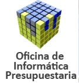

<!-- Portada para PDF -->

  
  
  

Plan Director TIC · Administración Presupuestaria 2025–2027

Oficina de Informática Presupuestaria · Ministerio de Hacienda

Versión: 1.0 · Fecha: {{ date }}

# 1. Resumen ejecutivo

El **Plan Director TIC 2025–2027** define la hoja de ruta tecnológica de la **Oficina de Informática Presupuestaria (OIP)** y su papel en la modernización de la **Administración Presupuestaria**.

Su finalidad es asegurar que la infraestructura, los sistemas y los servicios digitales evolucionen de forma coordinada, segura y eficiente, alineados con los objetivos de transformación del Ministerio de Hacienda.

El documento recoge los principales ámbitos de actuación:
- **Modernización de infraestructuras y comunicaciones**, garantizando la disponibilidad y la seguridad de los servicios.  
- **Gobierno del dato y administración digital**, impulsando la interoperabilidad y la transparencia.  
- **Ciberseguridad** como pilar esencial para la protección de la información.  
- **Automatización y uso de inteligencia artificial**, con la implantación de Copilot en el entorno M365.  
- **Optimización del puesto de usuario**, orientado al trabajo colaborativo, seguro y móvil.  
- **Gestión eficiente de recursos humanos y económicos**, asegurando la sostenibilidad operativa.  

El Plan refuerza la visión de la OIP como **centro TIC de referencia**, integrador de soluciones, garante del cumplimiento normativo y motor de innovación dentro de la Administración Presupuestaria.

---

# 2. Infografía visual

  
  <h3>Infraestructura y comunicaciones</h3>
  
Modernización de centros de datos, redes y servicios de conectividad segura.

  
  <h3>Ciberseguridad y ENS</h3>
  
Certificación ENS, gestión de riesgos, SOC y protección de infraestructuras críticas.

  
  <h3>Gestión del dato</h3>
  
Gobierno, calidad y explotación del dato para la toma de decisiones.

  
  <h3>IA y automatización</h3>
  
Implantación de Copilot y flujos automatizados para aumentar la eficiencia.

  
  <h3>Puesto de usuario</h3>
  
Entorno digital seguro, colaborativo y centrado en la experiencia del empleado.

  
  <h3>Personas y organización</h3>
  
Desarrollo profesional, formación y mejora continua en la OIP.

---

# 3. Indicadores clave (KPIs)

  

    
Certificación ENS renovada

    
100%

  

  

    
Uso de M365 Copilot

    
70%

  

  

    
Procesos automatizados

    
45%

  

  

    
Disponibilidad de servicios críticos

    
99.8%

  

  

    
Reducción de incidencias en puesto de usuario

    
-25%

  

  

    
Participación en formación TIC

    
+40%

  

---

## Conclusión

El Plan Director 2025–2027 consolida un modelo TIC **centrado en el dato, la seguridad y las personas**, con una gestión más ágil, transparente y sostenible.  
Su aplicación garantizará una Administración Presupuestaria más moderna, eficiente y conectada.
