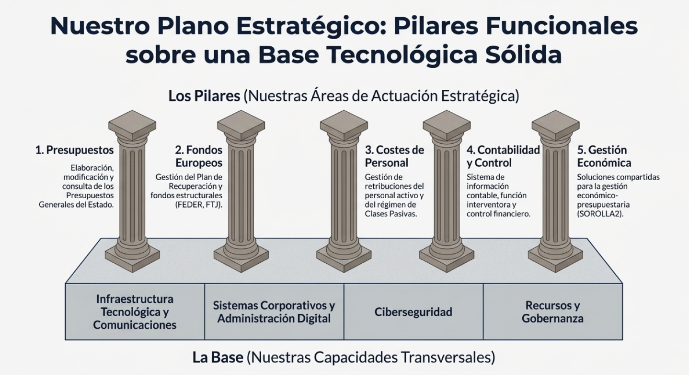
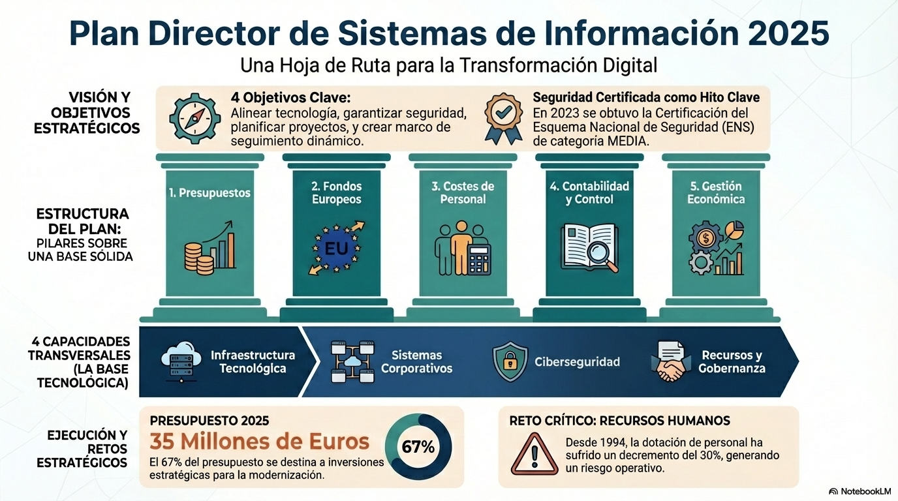
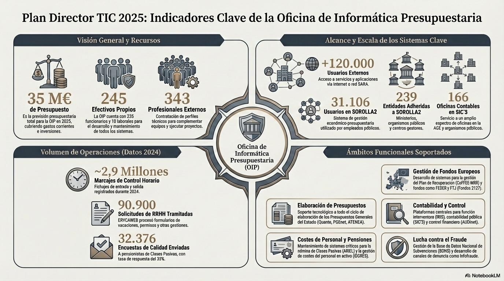

  

El **Plan Director TIC 2025–2027** define la hoja de ruta tecnológica de la **Oficina de Informática Presupuestaria (OIP)** y su papel en la modernización de la **Administración Presupuestaria**.

Su finalidad es asegurar que la infraestructura, los sistemas y los servicios digitales evolucionen de forma coordinada, segura y eficiente, alineados con los objetivos de transformación del Ministerio de Hacienda.

El documento recoge los principales ámbitos de actuación:
- **Modernización de infraestructuras y comunicaciones**, garantizando la disponibilidad y la seguridad de los servicios.  
- **Gobierno del dato y administración digital**, impulsando la interoperabilidad y la transparencia.  
- **Ciberseguridad** como pilar esencial para la protección de la información.  
- **Automatización y uso de inteligencia artificial**, con la implantación de Copilot en el entorno M365.  
- **Optimización del puesto de usuario**, orientado al trabajo colaborativo, seguro y móvil.  
- **Gestión eficiente de recursos humanos y económicos**, asegurando la sostenibilidad operativa.  

El Plan refuerza la visión de la OIP como **centro TIC de referencia**, integrador de soluciones, garante del cumplimiento normativo y motor de innovación dentro de la Administración Presupuestaria.

  

# Indicadores clave (KPIs)

  

El Plan Director 2025–2027 consolida un modelo TIC **centrado en el dato, la seguridad y las personas**, con una gestión más ágil, transparente y sostenible.  
Su aplicación garantizará una Administración Presupuestaria más moderna, eficiente y conectada.
